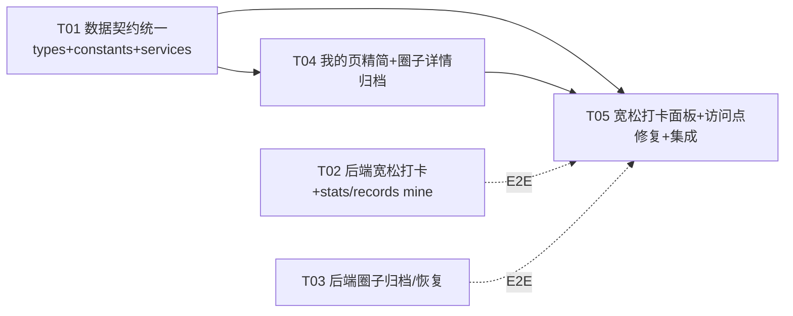

# 健身打卡微信小程序 — 本轮系统设计文档（宽松打卡 / 字段统一 / 圈子归档 / 我的页精简）

> 架构师：高见远（Bob）｜团队：software-fitness-opt
> 依据：产品经理许清楚已确认的需求定义 + docs/team-context.md 已核实技术事实

---

## Part A: System Design

### 0. 方案选型结论（字段命名统一 A/B/C）

**结论：采用方案 C —— 前端 types 全部改驼峰 + 修复全部访问点；后端命名零改动。**

| 方案 | 做法 | 判定 | 核心理由 |
|---|---|---|---|
| A | 后端全局配置 `property-naming-strategy: SNAKE_CASE` | ❌ 否决 | Jackson 命名策略**只对 POJO 生效，对 `Map<String,Object>` 的 key 不做转换**。而圈子详情、成员列表、统计、登录响应、文件上传等**全部是 Map 返回**（`circleId/inviteCode/userId/token...` 照旧驼峰）；只有实体返回（`/circles/my` 的 `List<Circle>`、打卡记录实体）会变下划线。结果是**同一页面两种命名混用**，比现状更糟。 |
| B | 后端实体逐个加 `@JsonProperty` | ❌ 否决 | 同样不解决 Map key；需注解 30+ 字段，维护成本高，治标不治本。 |
| C | 前端 types 全改驼峰 + 修访问点 | ✅ 采纳 | 后端（实体 + Map）**已经是统一的驼峰真相源**；前端 types 是纯 TS 接口，改动机械可控；登录/统计/详情等 Map 输出天然一致；后端命名零改动、零回归风险。 |

**登录链路影响确认（方案C下）：**
- `AuthController.wxLogin` 返回 `Map {token, userId, openid, nickname, avatarUrl}` —— Map key 不做任何转换，**`login.tsx` 读 `result.data.token` 不受影响**（token 为单字，即使方案A也不会变）。
- `UserContext.login(user)` 存 `user.token` → 不受影响。
- `/auth/userinfo` 返回 Map `{userId, openid, nickname, avatarUrl, createdAt}` → 不受影响。
- 唯一需要同步的是 `UserService.login` 的 TS 返回类型声明（当前错误声明为 `{user, token, isNewUser}`，实际是扁平 Map），T01 一并修正。

**圈子状态统一（二选一决策）：采用「数字 1/0 线上传输」**
- 后端 `Circle.status` 与数据库现状即为 Integer（1=活跃，0=已归档/原禁用），零后端改动。
- 前端 `CircleStatus` 字符串枚举（'active'/'archived'）**删除**，改为 `status: 0 | 1`，提供 `isCircleActive(status)` 助手（现 `Number(circle.status) === 1` 判断保留并收敛到助手函数）。
- 成员 `role` 同理：数字 `0普通 / 1管理员 / 2创建者`，前端 `UserRole` 字符串枚举删除，改 number + `isCreatorRole(role)`。

---

### 1. Implementation Approach

#### 核心难点
1. **字段命名端到端不一致（本轮正确性核心）**：后端实体/Map 全驼峰，前端 types 全下划线 + 39+ 处访问点用 `_id`。选方案C统一到后端真相源。
2. **宽松打卡**：`POST /checkin` 的 `planId` 由必填改可选，需在 Service 层分流"计划校验"与"全局时长校验"；新增 `circle_id` 列与字段。
3. **用户维度统计**：新增 `/checkin/stats/mine`，其中 `currentStreak`（连续打卡）与 `completionRate`（仅进行中计划）需要新的聚合逻辑。
4. **圈子归档控制入口**：新增 archive/restore 接口（仅创建者），前端详情页按状态渲染。
5. **底部半屏打卡面板（非跳页）**：Taro 小程序无内置半屏面板，需自定义固定定位 View + 遮罩 + 上滑动画。

#### 技术选型（沿用现有栈，不引入新依赖）
- 前端：Taro 3 + React + TypeScript（现有）；面板用 Taro `View` 自绘 + CSS 动画；本地记忆用 `Taro.setStorageSync`。
- 后端：Spring Boot 3.2.5 + MyBatis-Plus + MySQL（现有）；字段统一不依赖 Jackson 配置，全部走方案C。
- 架构模式：前后端分层架构不变（Controller / Service / Mapper / Entity；前端 Page / Component / Service / Context）。

---

### 2. File List

**后端（fitness-checkin-backend/src/main/java/com/fitness/checkin/）**
```
dto/CheckinRequest.java                     # 改造：planId 可空、新增 circleId、duration 全局 1-480
entity/CheckinRecord.java                   # 改造：新增 circleId
mapper/CheckinRecordMapper.java             # 改造：新增用户维度统计/连续打卡日期/分页查询
service/CheckinService.java                 # 改造：checkin 签名加 circleId；新增 mine 统计/记录方法
service/impl/CheckinServiceImpl.java        # 改造：宽松打卡分流 + mine 统计/记录实现
controller/CheckinController.java           # 改造：POST /checkin 传 circleId；新增 /stats/mine、/records/mine；修 total
controller/CircleController.java            # 改造：新增 POST /{id}/archive、POST /{id}/restore
service/CircleService.java                  # 改造：新增 archiveCircle/restoreCircle
service/impl/CircleServiceImpl.java         # 改造：实现归档/恢复；join 已归档拦截文案
service/impl/PlanServiceImpl.java           # 改造：createPlan 拦截已归档圈子
sql/init.sql                                # 改造：checkin_records 加 circle_id、plan_id 允许 NULL
```
> 注：生产库用 ALTER 语句（见 §5 SQL），init.sql 同步更新供新环境使用。

**前端（src/）**
```
types/index.ts                             # 改造：全部实体/请求/分页类型驼峰化 + status/role 数字
types/constants.ts                         # 改造：新增 lastExerciseType 存储键、时长档位常量、状态助手
services/CheckinService.ts                 # 改造：createCheckin 驼峰 + remark；getMyStats→/stats/mine；getMyCheckins→/records/mine
services/CircleService.ts                  # 改造：驼峰 + archiveCircle/restoreCircle
services/PlanService.ts                    # 改造：驼峰
services/UserService.ts                    # 改造：login 返回类型对齐后端扁平 Map
pages/index/index.tsx                      # 改造：接入打卡面板；驼峰访问点
pages/circle/detail/detail.tsx             # 改造：状态标签/归档提示/归档恢复/隐藏按钮/邀请码；接入面板
pages/circle/circle.tsx                    # 改造：驼峰访问点
pages/circle/create/create.tsx             # 改造：驼峰访问点
pages/circle/join/join.tsx                 # 改造：驼峰访问点
pages/plan/detail/detail.tsx               # 改造：驼峰访问点
pages/profile/profile.tsx                  # 改造：精简（删运动数据/我的圈子/创建/加入）；加设置占位入口
pages/profile/settings/settings.tsx/.scss/.config.ts  # 新增：设置占位页（P1）
pages/profile/history/history.tsx          # 改造：/records/mine 分页 + 驼峰访问点
pages/checkin/checkin.tsx                  # 改造：保留兼容旧入口，字段驼峰（不再作为主入口）
components/checkin/LooseCheckinPanel.tsx/.scss        # 新增：宽松打卡半屏面板（P0 核心）
components/checkin/CheckinButton.tsx       # 改造：disabled 逻辑放宽（无计划也可打卡）
components/checkin/CheckinCard.tsx         # 改造：驼峰访问点
components/circle/CircleCard.tsx           # 改造：驼峰访问点；邀请码默认不显示（需求五修正）
components/circle/MemberAvatarList.tsx     # 改造：驼峰访问点
components/plan/PlanProgressCard.tsx       # 改造：驼峰访问点
context/UserContext.tsx / CircleContext.tsx / PlanContext.tsx  # 改造：驼峰访问点
```

---

### 3. Data Structures and Interfaces

见 `docs/class-diagram.mermaid`（已同步本文件 §3.1 内容）。

关键接口定义：
- `POST /checkin` 请求体（改造后）：
```json
{ "planId": null, "circleId": 1, "duration": 30, "exerciseType": "running", "photoUrl": "", "remark": "" }
```
- `GET /checkin/stats/mine` 响应 data：
```json
{ "todayDuration": 30, "totalDuration": 120, "checkinDays": 3, "totalCheckins": 5, "currentStreak": 2, "completionRate": 66.7 }
```
- `GET /checkin/records/mine?page=1&size=20&planId=&exerciseType=&startDate=&endDate=` 响应 data：
```json
{ "records": [], "total": 0, "page": 1, "size": 20 }
```

---

### 4. Program Call Flow

见 `docs/sequence-diagram.mermaid`（宽松打卡全流程 + 圈子归档流程）。

---

### 5. Anything UNCLEAR（假设与待确认）

1. **归档圈子后其进行中计划如何处置**：需求未明说。假设：归档后不允许新打卡（后端 `checkin` 校验关联圈子未归档）、不允许创建计划、不允许加入；历史计划与记录保留可查看。若产品希望"归档后计划自动结束"，需追加 T03 的级联逻辑。
2. **`completionRate` 口径**：需求"仅针对进行中计划"。假设为：所有进行中计划的（用户打卡天数合计 ÷ 计划总天数合计）× 100；无进行中计划时为 0。
3. **宽松打卡是否计入圈子统计**：需求明确计入个人总时长/打卡天数；圈子维度统计暂不纳入宽松记录（`circle_id` 仅为记录归属，本轮圈子统计接口未改造）。若后续要按圈子聚合需再加接口。
4. **`/checkin/records/{planId}` 是否保留**：保留（历史兼容），新增 `/checkin/records/mine` 替代前端原先 `/checkin/records/0` 的用法。Spring 对字面量 `mine` 优先于 `{planId}` 匹配，但需回归验证。
5. **设置入口**：P1，仅入口 + 简单占位页，不实现具体设置项。
6. **卡片邀请码**：产品评审标记"已满足"，但代码核查显示 `CircleCard` 非 compact 时**仍显示邀请码**（index 首页 / circle 列表页均未传 compact）——与需求五矛盾，本轮在 T04 修正为默认不显示（详情页头部展示）。

---

## Part B: Task Decomposition

### 6. Required Packages

本轮**不新增**第三方依赖（前端沿用 Taro 3 + React；后端沿用 Spring Boot/MyBatis-Plus/Lombok）：
```
（无新增）
```

### 7. Task List（有序，按依赖）

#### T01 共享数据契约统一（前端 types + constants + services）— P0
- **Source Files**：`src/types/index.ts`、`src/types/constants.ts`、`src/services/CheckinService.ts`、`src/services/CircleService.ts`、`src/services/PlanService.ts`、`src/services/UserService.ts`
- **Dependencies**：无
- **内容**：
  - types 全部驼峰化：`User.userId/avatarUrl/createdAt`、`Circle.circleId/creatorId/maxMembers/inviteCode/createdAt`（status 改 `0|1`）、`CircleMember.id/circleId/userId/joinedAt`（role 改 number）、`Plan.planId/circleId/startDate/endDate/totalDurationGoal/dailyDurationGoal/circleTotalGoal/minDurationPerCheckin`、`CheckinRecord.recordId/planId?/circleId?/userId/exerciseType/photoUrl/remark/checkinTime`。
  - 请求类型：`CreateCircleRequest.maxMembers`、`JoinCircleRequest.inviteCode`、`CreatePlanRequest` 全驼峰、`CreateCheckinRequest.planId?/circleId?/remark`。
  - `UserExerciseStats` 对齐 `/stats/mine`：`todayDuration/totalDuration/checkinDays/totalCheckins/currentStreak/completionRate`。
  - `PaginatedResult` 对齐后端 `{records,total,page,size}`。
  - constants：新增 `STORAGE_KEYS.LAST_EXERCISE_TYPE`、`DURATION_QUICK_OPTIONS=[15,30,45,60]`、`MAX_DURATION=480`（CHECKIN_RULES 更新）、`isCircleActive`/`isCreatorRole` 助手。
  - Services：`CheckinService.createCheckin`（驼峰+remark+可选 planId/circleId）、`getMyStats→/checkin/stats/mine`、`getMyCheckins→/checkin/records/mine?page=&size=&planId=`、upload 返回 `{url}`；`CircleService.archiveCircle/restoreCircle`；`UserService.login` 返回类型修正为扁平 Map。
- **验收**：`npx tsc --noEmit` 通过（或 `taro build` 类型检查段通过）。

#### T02 后端宽松打卡 + 用户维度统计/记录 — P0
- **Source Files**：`dto/CheckinRequest.java`、`entity/CheckinRecord.java`、`mapper/CheckinRecordMapper.java`、`service/CheckinService.java`、`service/impl/CheckinServiceImpl.java`、`controller/CheckinController.java`、`sql/init.sql`
- **Dependencies**：无（可与 T01/T03 并行）
- **内容**：
  - `CheckinRequest`：`planId` 去 `@NotNull`（可空）；`duration` 加 `@Max(480)`（全局 1-480）；新增 `circleId`（可空，Service 校验成员）。
  - `CheckinRecord`：新增 `private Long circleId;`。
  - `CheckinServiceImpl.checkin`：时长全局校验 1-480；`planId!=null` 时走原计划校验（存在/进行中/成员/`duration>=minDurationPerCheckin`）+ 校验计划所属圈子未归档；`planId==null` 时跳过计划校验（宽松打卡）；`circleId!=null` 时校验是成员；`planId!=null && circleId==null` 时默认记 plan 所属圈子。
  - Mapper 新增：`selectTodayDurationByUserId`、`selectTotalDurationByUserId`、`selectCheckinDaysByUserId`、`selectTotalCheckinsByUserId`、`selectDistinctCheckinDatesByUserId`（连续打卡 Java 计算）。
  - 新增 `getUserCheckinStatsMine(userId)`：`{todayDuration,totalDuration,checkinDays,totalCheckins,currentStreak,completionRate}`（completionRate 仅进行中计划）。
  - 新增 `getUserCheckinRecordsMine(userId, planId?, exerciseType?, startDate?, endDate?, page, size)`：QueryWrapper 组合筛选 + 分页。
  - `CheckinController`：新增 `GET /checkin/stats/mine`、`GET /checkin/records/mine`；`POST /checkin` 传 circleId；**修复 `buildPageResult` 的 total 用 `page.getTotal()` 而非 `records.size()`**。
  - SQL：见下方 ALTER。
- **SQL 变更（生产执行 + init.sql 同步）**：
```sql
ALTER TABLE checkin_records ADD COLUMN circle_id BIGINT NULL COMMENT '圈子ID（可空，宽松打卡）' AFTER plan_id;
ALTER TABLE checkin_records ADD INDEX idx_circle_id (circle_id);
ALTER TABLE checkin_records MODIFY COLUMN plan_id BIGINT NULL COMMENT '计划ID（可空，宽松打卡）';
```

#### T03 后端圈子归档/恢复 + 归档约束 — P0
- **Source Files**：`controller/CircleController.java`、`service/CircleService.java`、`service/impl/CircleServiceImpl.java`、`service/impl/PlanServiceImpl.java`
- **Dependencies**：无（可与 T01/T02 并行）
- **内容**：
  - `POST /circles/{id}/archive`、`POST /circles/{id}/restore`：仅创建者（`creatorId == userId`，或成员 role==2），404/403 语义清晰。
  - `archiveCircle`：status 1→0；`restoreCircle`：status 0→1。
  - `joinCircle`：status!=1 时文案改为"圈子已归档"（功能不变）。
  - `PlanServiceImpl.createPlan`：校验 `circle.status==1`，否则抛"圈子已归档，无法创建计划"。

#### T04 前端"我的"精简 + 圈子详情状态/归档 + 设置占位 — P0
- **Source Files**：`src/pages/profile/profile.tsx`、`src/pages/profile/profile.scss`、`src/pages/profile/settings/settings.tsx/.scss/.config.ts`、`src/pages/circle/detail/detail.tsx`、`src/pages/circle/detail/detail.scss`、`src/components/circle/CircleCard.tsx`、`src/components/circle/CircleCard.scss`
- **Dependencies**：T01
- **内容**：
  - profile.tsx：删除运动数据 4 宫格、我的圈子、创建圈子、加入圈子；保留用户信息卡、运动历史、退出登录；新增设置占位入口（toast"功能开发中"或跳 settings 占位页）。
  - circle/detail.tsx：头部状态标签（`isCircleActive(circle.status)` → 绿点"进行中"/灰点"已归档"）；已归档时顶部提示条 + 隐藏"创建计划/今日打卡"按钮；设置区仅创建者显示"归档/恢复"（`Taro.showModal` 二次确认）；邀请码头部展示（`inviteCode`）+ 复制。
  - CircleCard.tsx：字段驼峰；**邀请码默认不显示**（修正需求五——首页/列表卡片不显示邀请码，邀请码仅详情页头部展示）。
- **验收**：我的页无圈子/统计区；圈子详情状态正确、归档后按钮隐藏、创建者可归档/恢复。

#### T05 宽松打卡面板 + 全量访问点修复 + 集成编译 — P0
- **Source Files**：`src/components/checkin/LooseCheckinPanel.tsx/.scss`、`src/pages/index/index.tsx`、`src/pages/circle/detail/detail.tsx`（面板接入）、`src/pages/checkin/checkin.tsx`、`src/pages/profile/history/history.tsx`、`src/pages/circle/circle.tsx`、`src/pages/circle/create/create.tsx`、`src/pages/circle/join/join.tsx`、`src/pages/plan/detail/detail.tsx`、`src/context/UserContext.tsx`、`src/context/CircleContext.tsx`、`src/context/PlanContext.tsx`、`src/components/checkin/CheckinButton.tsx`、`src/components/checkin/CheckinCard.tsx`、`src/components/circle/MemberAvatarList.tsx`、`src/components/plan/PlanProgressCard.tsx`
- **Dependencies**：T01、T04（T02/T03 为端到端前置，非编译阻塞）
- **内容**：
  - `LooseCheckinPanel`：半屏底部面板（遮罩 + 上滑动画）；运动类型宫格（默认记 `lastExerciseType`）→ 时长快速档 15/30/45/60 + 手动 Input 1-480（必填）→ 可选关联圈子（`getMyCircles`，默认 `lastCircleId`）→ 可选照片/备注 → 完成打卡 → toast 成功 + 面板内结果摘要（本次时长/类型/今日累计 `getMyStats`）→ 1.5s 后 `onSuccess()` 收起刷新。
  - 首页 `CheckinButton` 与圈子详情"今日打卡"改为打开面板（有进行中计划时传 `planId`，无计划也可宽松打卡）。
  - 全量访问点修复：按 §8 映射表将 ~40 处 `_id`/下划线访问改为驼峰（`circle._id→circleId`、`plan._id→planId`、`record._id→recordId`、`member._id→id`、`note→remark`、`uploadRes.data.tempFileURL→data.url` 等）。
  - `npx taro build --type weapp` 编译通过（后台运行，勿阻塞）。
- **验收**：首页无计划也可打卡；打卡后面板显示今日累计并自动收起刷新；全站无 undefined 字段（grep 复核无 `._id`/`.circle_id` 等残留）。

---

### 8. Shared Knowledge（跨任务约定）

- **字段命名**：线上 JSON 一律驼峰（后端实体与 Map 均如此）；前端 types 与访问点全部驼峰。禁止再出现 `_id`/`circle_id` 等下划线访问。
- **圈子状态**：`status` 数字线上传输，`1=活跃`、`0=已归档`；前端用 `isCircleActive(status)`。
- **成员角色**：`role` 数字，`0=普通`、`1=管理员`、`2=创建者`；创建者判断 `isCreatorRole(role)` 或 `circle.creatorId === user.userId`。
- **打卡**：`POST /checkin` 的 `planId`/`circleId` 均可空（宽松打卡不传 planId，**传 null/省略，禁止传空字符串**，否则 Jackson Long 反序列化 400）；`duration` 全局 1-480。
- **API 响应**：统一 `{code, data, message}`，成功 `code===200`。
- **分页**：`GET /checkin/records/mine?page=&size=` 返回 `{records,total,page,size}`，`total` 用数据库总数。
- **时间**：后端 `yyyy-MM-dd HH:mm:ss`（Asia/Shanghai），前端 `new Date(str.replace(' ','T'))` 兼容解析。
- **基建**：前端 baseURL `http://124.222.95.76/api`；编译 `npx taro build --type weapp`（后台运行）；后端 `mvn clean package -DskipTests` + `systemctl restart fitness-checkin`；MySQL `fitness_user/Fitness@2026`。
- **勿回退**：`code===200` 判断、`/checkin` 单数路径、统计字段驼峰、tabbar 图标 `src/assets/tabbar/`、邀请码 8 位校验。

### 9. Task Dependency Graph



---

## 附：风险与注意事项

1. **方案A陷阱**：若有人改回"全局 SNAKE_CASE"，Map key 不受影响，会制造混合命名灾难；设计已锁定方案C，勿改。
2. **访问点修复量大**：~40 处跨 16 个文件，遗漏会白屏/undefined；T05 完成后必须全局 grep `\._id|\.circle_id|\.invite_code|\.max_members|\.created_at|\.creator_id|\.user_id|\.plan_id|\.checkin_time|\.exercise_type|\.photo_url|\.avatar_url|\.note\b|\.start_date|\.end_date|\.total_duration_goal|\.daily_duration_goal|\.min_duration_per_checkin|\.member_count` 复核为 0。
3. **路由冲突**：`/checkin/records/mine` 与 `/checkin/records/{planId}` —— Spring 字面量优先，但需回归；若异常可改名 `/checkin/my-records` 规避（已在 T02 预留）。
4. **空串 planId**：前端宽松打卡必须省略/传 null planId，禁止 `''`（Jackson 对 `Long` 空串反序列化失败）。
5. **生产 DB 迁移**：先备份；ALTER 低峰执行；旧记录 `plan_id` 不变、`circle_id=NULL`；`idx_plan_id` 索引对 NULL 不生效但无碍。
6. **归档语义**：归档后 join 已拦截（status!=1），创建计划/新打卡需 T02/T03 后端双重拦截 + T04/T05 前端隐藏，前后端必须一致，否则会出现"界面隐藏但接口可用"。
7. **upload 返回字段**：后端 `/files/upload` 返回 `data.url`，前端原先读 `tempFileURL`（bug），本轮统一为 `data.url`。
8. **登录存储**：`userInfo` 存的是登录扁平 Map（含 token/userId/nickname/avatarUrl），驼峰化后 `user.avatarUrl` 可用；注意它不含 createdAt/updatedAt，属部分 User 对象，勿强依赖。
