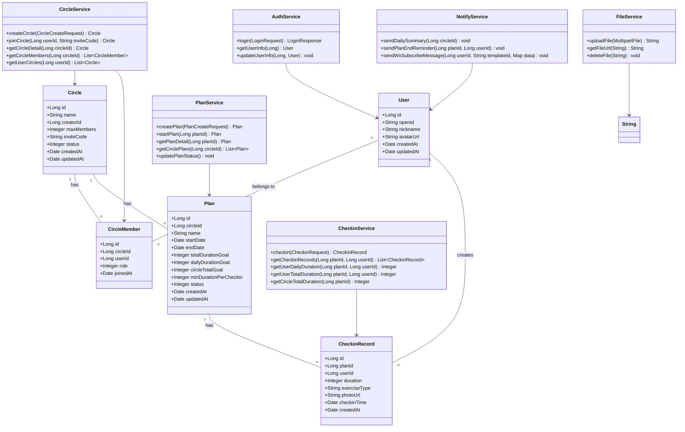
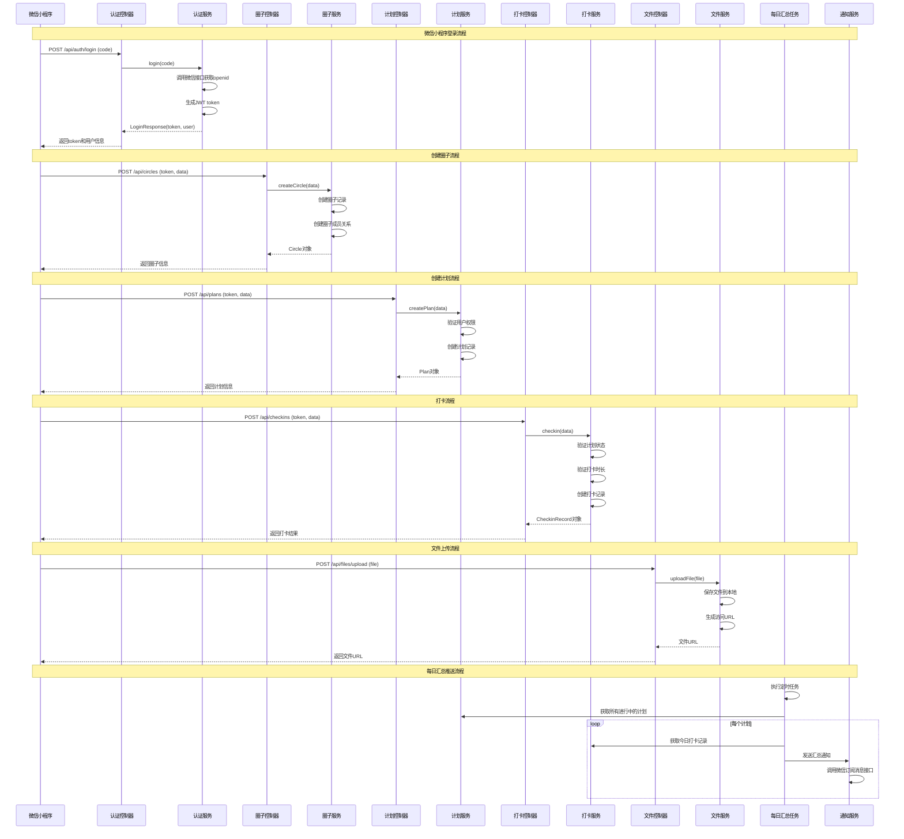
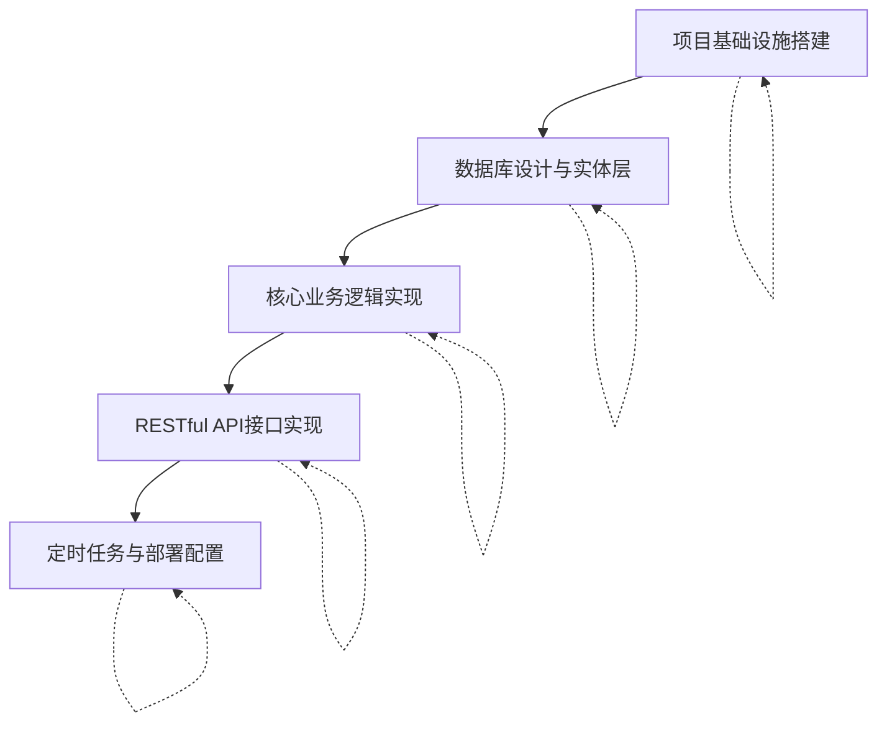

# 健身打卡后端系统设计文档

## Part A: System Design

### 1. Implementation Approach

#### 核心技术挑战
1. **微信小程序登录集成**：需要与微信服务器通信，获取用户openid和session_key，生成自定义登录态
2. **圈子与计划管理**：复杂的业务逻辑，包括圈子成员管理、计划状态流转、打卡验证等
3. **文件上传与存储**：运动照片上传到服务器本地磁盘，通过Nginx提供静态文件服务
4. **定时任务调度**：每日汇总推送和周期结束提醒需要可靠的定时任务机制
5. **数据一致性**：多人打卡时保证数据一致性，避免并发问题

#### 框架和库选择
- **Spring Boot 3.2+**：主框架，提供快速开发、自动配置、依赖管理
- **Spring Security**：安全框架，处理认证和授权
- **MyBatis-Plus**：ORM框架，简化数据库操作
- **MySQL 8.0**：关系型数据库，存储业务数据
- **阿里云OSS SDK**：本地文件存储（可选，后续可迁移到云存储）
- **Spring Task**：定时任务调度
- **Lombok**：简化Java代码
- **Hutool**：Java工具库，提供常用工具方法
- **微信小程序SDK**：与微信服务器通信

#### 架构模式
采用**分层架构**（Layered Architecture）：
- **Controller层**：处理HTTP请求，参数校验，返回响应
- **Service层**：业务逻辑处理，事务管理
- **DAO层**：数据访问层，与数据库交互
- **Entity层**：数据实体类
- **Config层**：配置类
- **Common层**：通用工具类、常量、异常处理

### 2. File List

```
fitness-checkin-backend/
├── pom.xml                                    # Maven项目配置
├── src/
│   ├── main/
│   │   ├── java/
│   │   │   └── com/
│   │   │       └── fitness/
│   │   │           └── checkin/
│   │   │               ├── Application.java          # Spring Boot启动类
│   │   │               ├── config/                   # 配置类
│   │   │               │   ├── WebConfig.java         # Web配置
│   │   │               │   ├── SecurityConfig.java    # 安全配置
│   │   │               │   ├── MybatisPlusConfig.java # MyBatis-Plus配置
│   │   │               │   └── WxMaConfig.java        # 微信小程序配置
│   │   │               ├── controller/               # 控制器
│   │   │               │   ├── AuthController.java    # 认证控制器
│   │   │               │   ├── CircleController.java  # 圈子控制器
│   │   │               │   ├── PlanController.java    # 计划控制器
│   │   │               │   ├── CheckinController.java # 打卡控制器
│   │   │               │   └── FileController.java    # 文件控制器
│   │   │               ├── service/                  # 服务层
│   │   │               │   ├── AuthService.java       # 认证服务
│   │   │               │   ├── CircleService.java     # 圈子服务
│   │   │               │   ├── PlanService.java       # 计划服务
│   │   │               │   ├── CheckinService.java    # 打卡服务
│   │   │               │   ├── FileService.java       # 文件服务
│   │   │               │   └── NotifyService.java     # 通知服务
│   │   │               ├── service/impl/             # 服务实现
│   │   │               │   ├── AuthServiceImpl.java
│   │   │               │   ├── CircleServiceImpl.java
│   │   │               │   ├── PlanServiceImpl.java
│   │   │               │   ├── CheckinServiceImpl.java
│   │   │               │   ├── FileServiceImpl.java
│   │   │               │   └── NotifyServiceImpl.java
│   │   │               ├── mapper/                   # MyBatis Mapper接口
│   │   │               │   ├── UserMapper.java
│   │   │               │   ├── CircleMapper.java
│   │   │               │   ├── CircleMemberMapper.java
│   │   │               │   ├── PlanMapper.java
│   │   │               │   └── CheckinRecordMapper.java
│   │   │               ├── entity/                   # 实体类
│   │   │               │   ├── User.java
│   │   │               │   ├── Circle.java
│   │   │               │   ├── CircleMember.java
│   │   │               │   ├── Plan.java
│   │   │               │   └── CheckinRecord.java
│   │   │               ├── dto/                      # 数据传输对象
│   │   │               │   ├── LoginRequest.java
│   │   │               │   ├── LoginResponse.java
│   │   │               │   ├── CircleCreateRequest.java
│   │   │               │   ├── PlanCreateRequest.java
│   │   │               │   ├── CheckinRequest.java
│   │   │               │   └── Result.java           # 统一响应格式
│   │   │               ├── common/                   # 通用类
│   │   │               │   ├── ResultCode.java       # 响应状态码
│   │   │               │   ├── BusinessException.java # 业务异常
│   │   │               │   ├── GlobalExceptionHandler.java # 全局异常处理
│   │   │               │   └── Constants.java        # 常量
│   │   │               ├── task/                     # 定时任务
│   │   │               │   ├── DailySummaryTask.java # 每日汇总任务
│   │   │               │   └── PlanEndReminderTask.java # 计划结束提醒
│   │   │               └── util/                     # 工具类
│   │   │                   ├── WxMaUtil.java         # 微信小程序工具
│   │   │                   └── FileUtil.java         # 文件工具
│   │   └── resources/
│   │       ├── application.yml                      # 应用配置
│   │       ├── application-dev.yml                  # 开发环境配置
│   │       ├── application-prod.yml                 # 生产环境配置
│   │       ├── logback-spring.xml                   # 日志配置
│   │       └── mapper/                              # MyBatis XML映射文件
│   │           ├── UserMapper.xml
│   │           ├── CircleMapper.xml
│   │           ├── CircleMemberMapper.xml
│   │           ├── PlanMapper.xml
│   │           └── CheckinRecordMapper.xml
│   └── test/                                      # 测试代码
├── sql/                                           # SQL脚本
│   └── init.sql                                   # 数据库初始化脚本
├── nginx/                                         # Nginx配置
│   └── fitness-checkin.conf
├── deploy/                                        # 部署脚本
│   ├── deploy.sh
│   └── fitness-checkin.service                    # systemd服务文件
└── docs/                                          # 文档
    └── API.md                                     # API接口文档
```

### 3. Data Structures and Interfaces



### 4. Program Call Flow



### 5. Anything UNCLEAR

1. **微信订阅消息权限**：需要用户主动订阅消息，如何引导用户订阅？
2. **图片存储路径**：建议存储在 `/data/fitness-checkin/uploads/` 目录下，按日期分目录
3. **每日汇总推送时间**：建议每天晚上8点（20:00）推送
4. **圈子人数限制**：硬性限制2-8人，不允许调整
5. **运动时长上限**：建议设置最大单次打卡时长为24小时（1440分钟）
6. **计划周期**：支持天和周两种单位，默认为周
7. **圈子名称**：允许同名圈子
8. **邀请机制**：通过邀请码加入，邀请码为6位随机字符串
9. **数据保留**：永久保留历史数据
10. **并发打卡**：同一天多次打卡，数据独立存储，查询时合并计算总时长

## Part B: Task Decomposition

### 6. Required Packages

```
# Maven依赖（pom.xml）
- spring-boot-starter-web: Spring Boot Web启动器
- spring-boot-starter-security: Spring Security安全框架
- spring-boot-starter-data-jpa: JPA数据访问
- mybatis-plus-boot-starter: MyBatis-Plus ORM框架
- mysql-connector-java: MySQL数据库驱动
- lombok: Lombok代码简化
- hutool-all: Hutool工具库
- weixin-java-miniapp: 微信小程序SDK
- jjwt: JWT令牌处理
- spring-boot-starter-validation: 数据校验
- spring-boot-starter-test: 测试支持
- spring-boot-starter-log4j2: 日志框架
```

### 7. Task List (ordered by dependency)

#### T01: 项目基础设施搭建
**Task ID**: T01  
**Task Name**: 项目基础设施搭建  
**Source Files**: 
- `pom.xml`
- `src/main/java/com/fitness/checkin/Application.java`
- `src/main/resources/application.yml`
- `src/main/resources/application-dev.yml`
- `src/main/resources/application-prod.yml`
- `src/main/resources/logback-spring.xml`

**Dependencies**: 无  
**Priority**: P0

**Description**: 创建Spring Boot项目基础结构，配置Maven依赖，设置多环境配置文件，配置日志系统。

#### T02: 数据库设计与实体层
**Task ID**: T02  
**Task Name**: 数据库设计与实体层  
**Source Files**:
- `sql/init.sql`
- `src/main/java/com/fitness/checkin/entity/User.java`
- `src/main/java/com/fitness/checkin/entity/Circle.java`
- `src/main/java/com/fitness/checkin/entity/CircleMember.java`
- `src/main/java/com/fitness/checkin/entity/Plan.java`
- `src/main/java/com/fitness/checkin/entity/CheckinRecord.java`
- `src/main/java/com/fitness/checkin/mapper/*.java`
- `src/main/resources/mapper/*.xml`

**Dependencies**: T01  
**Priority**: P0

**Description**: 设计MySQL数据库表结构，创建SQL初始化脚本，实现MyBatis实体类和Mapper接口。

#### T03: 核心业务逻辑实现
**Task ID**: T03  
**Task Name**: 核心业务逻辑实现  
**Source Files**:
- `src/main/java/com/fitness/checkin/service/AuthService.java`
- `src/main/java/com/fitness/checkin/service/CircleService.java`
- `src/main/java/com/fitness/checkin/service/PlanService.java`
- `src/main/java/com/fitness/checkin/service/CheckinService.java`
- `src/main/java/com/fitness/checkin/service/FileService.java`
- `src/main/java/com/fitness/checkin/service/impl/*.java`
- `src/main/java/com/fitness/checkin/dto/*.java`
- `src/main/java/com/fitness/checkin/common/*.java`

**Dependencies**: T02  
**Priority**: P0

**Description**: 实现核心业务逻辑，包括认证、圈子管理、计划管理、打卡、文件上传等服务。定义数据传输对象和通用异常处理。

#### T04: RESTful API接口实现
**Task ID**: T04  
**Task Name**: RESTful API接口实现  
**Source Files**:
- `src/main/java/com/fitness/checkin/controller/AuthController.java`
- `src/main/java/com/fitness/checkin/controller/CircleController.java`
- `src/main/java/com/fitness/checkin/controller/PlanController.java`
- `src/main/java/com/fitness/checkin/controller/CheckinController.java`
- `src/main/java/com/fitness/checkin/controller/FileController.java`
- `src/main/java/com/fitness/checkin/config/SecurityConfig.java`
- `src/main/java/com/fitness/checkin/config/WebConfig.java`

**Dependencies**: T03  
**Priority**: P0

**Description**: 实现RESTful API接口，配置Spring Security安全策略，设置跨域和请求过滤。

#### T05: 定时任务与部署配置
**Task ID**: T05  
**Task Name**: 定时任务与部署配置  
**Source Files**:
- `src/main/java/com/fitness/checkin/task/DailySummaryTask.java`
- `src/main/java/com/fitness/checkin/task/PlanEndReminderTask.java`
- `src/main/java/com/fitness/checkin/service/NotifyService.java`
- `src/main/java/com/fitness/checkin/service/impl/NotifyServiceImpl.java`
- `nginx/fitness-checkin.conf`
- `deploy/deploy.sh`
- `deploy/fitness-checkin.service`

**Dependencies**: T04  
**Priority**: P1

**Description**: 实现定时任务（每日汇总推送和周期结束提醒），配置Nginx反向代理和HTTPS，创建systemd服务文件和部署脚本。

### 8. Shared Knowledge

1. **统一响应格式**：所有API响应使用 `{code, data, message}` 格式
   ```json
   {
     "code": 200,
     "data": { ... },
     "message": "success"
   }
   ```

2. **认证方式**：使用JWT令牌认证，请求头格式为 `Authorization: Bearer <token>`

3. **日期格式**：所有日期时间存储为UTC时间，API返回格式为ISO 8601（如：2024-01-01T00:00:00Z）

4. **文件存储路径**：运动照片存储在 `/data/fitness-checkin/uploads/` 目录下，按年月日分目录

5. **微信登录流程**：小程序获取code → 后端用code换取openid → 生成JWT token

6. **圈子邀请码**：6位随机字符串，包含大写字母和数字

7. **计划状态流转**：未开始(0) → 进行中(1) → 已结束(2)

8. **打卡时长限制**：每次打卡最低10分钟，最高24小时（1440分钟）

### 9. Task Dependency Graph



### 10. 部署指南

#### 10.1 服务器环境要求
- 操作系统：CentOS 7+ / Ubuntu 20.04+
- Java版本：JDK 17+
- MySQL版本：8.0+
- Nginx版本：1.18+
- 内存：至少2GB
- 磁盘：至少50GB

#### 10.2 部署步骤
1. **安装Java环境**
   ```bash
   # CentOS
   sudo yum install java-17-openjdk-devel
   # Ubuntu
   sudo apt install openjdk-17-jdk
   ```

2. **安装MySQL**
   ```bash
   # CentOS
   sudo yum install mysql-server
   # Ubuntu
   sudo apt install mysql-server
   ```

3. **创建数据库和用户**
   ```sql
   CREATE DATABASE fitness_checkin;
   CREATE USER 'fitness'@'localhost' IDENTIFIED BY 'password';
   GRANT ALL PRIVILEGES ON fitness_checkin.* TO 'fitness'@'localhost';
   FLUSH PRIVILEGES;
   ```

4. **执行SQL初始化脚本**
   ```bash
   mysql -u fitness -p fitness_checkin < sql/init.sql
   ```

5. **部署Spring Boot应用**
   ```bash
   # 打包应用
   mvn clean package -DskipTests
   
   # 创建部署目录
   sudo mkdir -p /opt/fitness-checkin
   sudo cp target/fitness-checkin-*.jar /opt/fitness-checkin/app.jar
   
   # 创建systemd服务文件
   sudo cp deploy/fitness-checkin.service /etc/systemd/system/
   sudo systemctl daemon-reload
   sudo systemctl enable fitness-checkin
   sudo systemctl start fitness-checkin
   ```

6. **配置Nginx**
   ```bash
   # 安装Nginx
   sudo yum install nginx  # CentOS
   sudo apt install nginx  # Ubuntu
   
   # 复制配置文件
   sudo cp nginx/fitness-checkin.conf /etc/nginx/conf.d/
   
   # 创建SSL证书（Let's Encrypt）
   sudo yum install certbot python3-certbot-nginx
   sudo certbot --nginx -d yourdomain.com
   
   # 重启Nginx
   sudo systemctl restart nginx
   ```

7. **创建文件存储目录**
   ```bash
   sudo mkdir -p /data/fitness-checkin/uploads
   sudo chown -R fitness:fitness /data/fitness-checkin
   ```

#### 10.3 Nginx配置示例
```nginx
server {
    listen 80;
    server_name yourdomain.com;
    return 301 https://$server_name$request_uri;
}

server {
    listen 443 ssl http2;
    server_name yourdomain.com;
    
    ssl_certificate /etc/letsencrypt/live/yourdomain.com/fullchain.pem;
    ssl_certificate_key /etc/letsencrypt/live/yourdomain.com/privkey.pem;
    
    # API代理
    location /api/ {
        proxy_pass http://localhost:8080;
        proxy_set_header Host $host;
        proxy_set_header X-Real-IP $remote_addr;
        proxy_set_header X-Forwarded-For $proxy_add_x_forwarded_for;
        proxy_set_header X-Forwarded-Proto $scheme;
    }
    
    # 静态文件服务（运动照片）
    location /uploads/ {
        alias /data/fitness-checkin/uploads/;
        expires 30d;
        add_header Cache-Control "public, immutable";
    }
    
    # 其他配置...
}
```

#### 10.4 systemd服务配置
```ini
[Unit]
Description=Fitness Checkin Backend Service
After=syslog.target network.target

[Service]
User=fitness
Group=fitness
ExecStart=/usr/bin/java -jar /opt/fitness-checkin/app.jar --spring.profiles.active=prod
SuccessExitStatus=143
Restart=always
RestartSec=10
Environment="SPRING_PROFILES_ACTIVE=prod"
Environment="JAVA_OPTS=-Xms512m -Xmx1024m"

[Install]
WantedBy=multi-user.target
```

### 11. API接口文档摘要

#### 认证相关
- `POST /api/auth/login` - 微信登录
- `GET /api/auth/userinfo` - 获取用户信息

#### 圈子相关
- `POST /api/circles` - 创建圈子
- `POST /api/circles/join` - 加入圈子
- `GET /api/circles/{id}` - 获取圈子详情
- `GET /api/circles/{id}/members` - 获取圈子成员
- `GET /api/users/{id}/circles` - 获取用户圈子列表

#### 计划相关
- `POST /api/plans` - 创建计划
- `POST /api/plans/{id}/start` - 启动计划
- `GET /api/plans/{id}` - 获取计划详情
- `GET /api/circles/{id}/plans` - 获取圈子计划列表

#### 打卡相关
- `POST /api/checkins` - 打卡
- `GET /api/checkins` - 获取打卡记录
- `GET /api/plans/{id}/statistics` - 获取计划统计

#### 文件相关
- `POST /api/files/upload` - 上传文件
- `GET /api/files/{filename}` - 获取文件

### 12. 定时任务设计

#### 每日汇总推送（每天20:00执行）
1. 查询所有进行中的计划
2. 对于每个计划，查询今日打卡记录
3. 计算今日完成情况（总时长、人均时长）
4. 调用微信订阅消息接口发送汇总通知

#### 周期结束提醒（每天检查）
1. 查询即将结束的计划（结束日期在2天内）
2. 对于每个计划，查询成员完成情况
3. 对于未完成目标的成员，发送提醒通知

### 13. 文件存储方案

1. **存储路径**：`/data/fitness-checkin/uploads/`
2. **目录结构**：
   ```
   /data/fitness-checkin/uploads/
   ├── 2024/
   │   ├── 01/
   │   │   ├── 01/
   │   │   │   ├── abc123.jpg
   │   │   │   └── def456.jpg
   │   │   └── 02/
   │   └── 02/
   └── ...
   ```
3. **访问方式**：通过Nginx静态文件服务，URL格式为 `/uploads/2024/01/01/abc123.jpg`
4. **文件命名**：使用UUID生成唯一文件名，保留原始扩展名
5. **文件大小限制**：单个文件最大10MB
6. **支持格式**：JPG、PNG、GIF

### 14. 安全考虑

1. **HTTPS强制**：所有API请求必须通过HTTPS
2. **JWT安全**：token有效期24小时，使用RS256算法签名
3. **参数校验**：所有请求参数进行严格校验
4. **SQL注入防护**：使用MyBatis-Plus参数化查询
5. **XSS防护**：输出时进行HTML转义
6. **文件上传安全**：检查文件类型和大小，防止恶意文件上传
7. **权限控制**：验证用户对圈子/计划的操作权限
8. **日志记录**：记录关键操作日志，便于审计

---

**文档版本**: 1.0  
**最后更新**: 2024年1月  
**维护者**: 架构师高见远 (Gao)