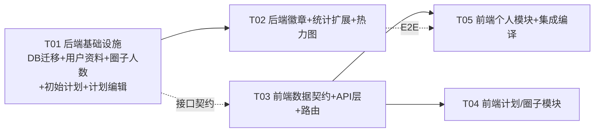

# 健身打卡微信小程序 — 本轮系统设计文档（初始计划 / 资料修改 / 运动生涯 / 热力图 / 徽章 / 圈子人数）

> 架构师：高见远（Bob）｜团队：software-fitness-plan
> 依据：产品方案已确认（方案B+C：创建圈子同事务生成初始计划；全部本轮做；徽章建表；初始计划仅"编辑+启动"）
> 技术事实：docs/team-context.md + 上一轮 docs/system_design.md（全驼峰 / status数字 / role数字等既有约定延续）

---

## Part A: System Design

### 1. Implementation Approach

#### 核心难点与对策

| # | 难点 | 对策 |
|---|---|---|
| 1 | **创建圈子同事务自动创建初始计划**，且 `CircleServiceImpl` 与 `PlanServiceImpl` 已互为依赖（PlanService→CircleService），若再让 CircleService→PlanService 会形成 Spring 循环引用（Boot 3 默认禁止） | 初始计划**不经过 PlanService**：在 `CircleServiceImpl.createCircle`（类级 `@Transactional`）内用 `PlanMapper` 直接插入固定值的 `Plan` 实体（status=0）。系统生成，无需校验（无进行中计划冲突、创建者即管理员），固定值收敛为 `buildInitialPlan(circle)` 私有方法 |
| 2 | **PUT /plans/{id} 部分字段更新** | 新增 `UpdatePlanRequest`（全部可选、至少一个字段）；`PlanServiceImpl.updatePlan` 校验「管理员(role≥1) + 仅 status=0」后按非空字段覆盖，日期校验沿用创建规则 |
| 3 | **徽章判定时机在 POST /checkin 成功后**，但 `BadgeService` 需要 stats，若 `CheckinServiceImpl` 注入 `BadgeService` 且 `BadgeService` 注入 `CheckinService` 会成环 | 由 **CheckinController 编排**：`checkin` 成功后调用 `badgeService.checkAndUnlock(userId)`；`BadgeService` 单向依赖 `CheckinService.getUserCheckinStatsMine` 取统计（口径天然一致，零重复）。`CheckinRecord` 增加 `@TableField(exist=false) newlyUnlockedBadges` 瞬态字段，随记录序列化返回（向后兼容，前端 `result.data.newlyUnlockedBadges`） |
| 4 | **stats/mine 扩展**（longestStreak + exerciseTypeBreakdown） | Mapper 新增 `selectExerciseTypeBreakdownByUserId`（GROUP BY exercise_type SUM(duration)）；`calcLongestStreak` 复用现有 `selectDistinctCheckinDatesByUserId`（Java 计算历史最长连续） |
| 5 | **热力图** | Mapper 新增 `selectHeatmapByUserId`（按天聚合 SUM(duration)/COUNT(*)）；新接口 `GET /checkin/heatmap/mine?days=365` |
| 6 | **里程徽章与前端系数一致性** | 系数表两端各一份且**必须同步**：running 8 / walking 5 / cycling 15 / swimming 3 / 其余 0（km/h）。后端 `BadgeCode.DISTANCE_50` 判定用 `exerciseTypeBreakdown × 系数` 求和；前端 `EXERCISE_SPEED_KMH` 仅用于 career 页展示。见 §8 |
| 7 | **上传 400 Bug（🔴 必修）** | `CheckinService.uploadPhoto` 现传 `name='photo'`，后端 `FileController` 是 `@RequestParam("file")` → 统一改 `name='file'`（头像与打卡照片共用） |
| 8 | **圈子列表 N+1** | 后端在 `getUserCircles` 内循环 `countByCircleId` 附加 `memberCount`（`Circle` 加 `@TableField(exist=false) memberCount`），前端直接消费，禁止前端逐圈请求 |

#### 技术选型（零新依赖）

- 前端：Taro 3 + React + TypeScript（现有）；新页面沿用 `pages/xxx/xxx.tsx + .scss + .config.ts` 三件套；热力图/徽章墙为自绘组件。
- 后端：Spring Boot 3.2.5 + MyBatis-Plus + MySQL（现有）；徽章定义用 Java 枚举 `BadgeCode` 集中管理（code/name/icon/conditionText/判定/进度文本），前端图标由后端 icon 字段下发（emoji）。
- 架构模式：前后端分层不变；新增 badge 模块（Controller/Service/Impl/Entity/Mapper），heatmap 归入 Checkin 模块。

---

### 2. File List

**后端（fitness-checkin-backend/src/main/java/com/fitness/checkin/）**

```
sql/init.sql                                      # 改造：+user_badges 建表（生产 ALTER 见 §5 SQL）
entity/UserBadge.java                             # 新增：徽章解锁记录（userId,badgeCode,unlockedAt，复合主键）
mapper/UserBadgeMapper.java                       # 新增：BaseMapper + selectByUserId + insertIgnore
constant/BadgeCode.java                           # 新增：8 个徽章枚举（code,name,icon,conditionText,isUnlocked(stats),progressText(stats)）
service/BadgeService.java                         # 新增：checkAndUnlock / getMyBadges
service/impl/BadgeServiceImpl.java                # 新增：判定 + 插入 + 进度文本 + 里程系数
controller/BadgeController.java                   # 新增：GET /badges/mine
dto/UpdateUserInfoRequest.java                    # 新增：PUT /auth/userinfo 请求体
dto/UpdatePlanRequest.java                        # 新增：PUT /plans/{id} 请求体（部分字段）
entity/CheckinRecord.java                         # 改造：+@TableField(exist=false) List<Map> newlyUnlockedBadges
entity/Circle.java                                # 改造：+@TableField(exist=false) Integer memberCount
dto/CreateCircleRequest.java                      # 改造：maxMembers 加 @Max(50)
controller/AuthController.java                    # 改造：+PUT /userinfo
controller/PlanController.java                    # 改造：+PUT /{planId}
controller/CheckinController.java                 # 改造：POST /checkin 附徽章；+GET /heatmap/mine
controller/CircleController.java                  # 改造：/circles/my 透传 memberCount（经 service）
service/impl/UserServiceImpl.java                 # 改造：updateUser 空串判断 → null 判断（允许清空 avatarUrl）
service/impl/CircleServiceImpl.java               # 改造：createCircle 同事务建初始计划；getUserCircles 附 memberCount
service/impl/PlanServiceImpl.java                 # 改造：+updatePlan
service/impl/CheckinServiceImpl.java              # 改造：stats/mine 扩展 longestStreak+exerciseTypeBreakdown；+getHeatmapMine
mapper/CheckinRecordMapper.java                   # 改造：+selectExerciseTypeBreakdownByUserId、+selectHeatmapByUserId
```

**前端（src/）**

```
types/index.ts                                    # 改造：Stats 扩展/Badge/Heatmap/Circle.memberCount/CheckinRecord.newlyUnlockedBadges/UpdatePlanRequest/UpdateUserInfoRequest
types/constants.ts                                # 改造：MAX_MEMBERS 8→50、MEMBER_LIMIT_OPTIONS、HEATMAP_LEVELS、EXERCISE_SPEED_KMH、PAGE_PATHS 增 career/PLAN_EDIT
services/CheckinService.ts                        # 改造：uploadPhoto name='file'（🔴 修 Bug）；getHeatmap；createCheckin 返回带 newlyUnlockedBadges
services/PlanService.ts                           # 改造：+updatePlan(planId,data)
services/BadgeService.ts                          # 新增：getMyBadges
services/UserService.ts                           # 改造：updateUserInfo payload 收敛 {nickname?,avatarUrl?}
app.config.ts                                     # 改造：注册 pages/profile/career/career、pages/plan/edit/edit
pages/profile/profile.tsx / profile.scss          # 改造：头像 ActionSheet+昵称编辑+运动生涯入口+徽章墙
pages/profile/career/career.tsx / career.scss / career.config.ts  # 新增：运动生涯页
pages/circle/detail/detail.tsx / detail.scss      # 改造：当前计划区三态渲染（进行中/待启动/无）+ 编辑/启动按钮
pages/plan/edit/edit.tsx / edit.scss / edit.config.ts            # 新增：计划编辑页（PUT /plans/{id}）
pages/circle/circle.tsx                           # 改造：memberCount={0} → circle.memberCount 真实值
pages/circle/create/create.tsx / create.scss      # 改造：人数档位 chips(2/5/8/15/30/50 默认8)
components/badge/BadgeWall.tsx / BadgeWall.scss   # 新增：徽章墙（3列 grid）
components/heatmap/Heatmap.tsx / Heatmap.scss     # 新增：活跃度热力图（7行×N周 12px 格子）
components/checkin/LooseCheckinPanel.tsx          # 改造：打卡成功后徽章 toast / 首徽章 showModal
```

---

### 3. Data Structures and Interfaces

见 `docs/class-diagram-r2.mermaid`（已同步本文件 §3.1 内容）。

关键接口定义：

- `POST /circles` 响应 data（Circle 实体）：新增 `memberCount`（=1，创建者本人）。
- `PUT /plans/{id}` 请求体（部分字段，至少一个）：
```json
{ "name": "晨跑计划", "description": "...", "startDate": "2026-08-06", "endDate": "2026-08-12",
  "totalDurationGoal": 210, "dailyDurationGoal": 30, "circleTotalGoal": 420, "minDurationPerCheckin": 10 }
```
  响应 data：更新后的 Plan 实体。400 条件：非管理员 / 非 status=0 / 日期非法。
- `PUT /auth/userinfo` 请求体（至少一个）：
```json
{ "nickname": "高见远", "avatarUrl": "https://..." }   // avatarUrl 可传 "" 清空
```
  响应 data：`{userId, openid, nickname, avatarUrl, createdAt}`（同 GET /auth/userinfo 形状）。
- `GET /checkin/stats/mine` 响应 data（新增两字段，旧字段不变）：
```json
{ "todayDuration": 30, "totalDuration": 120, "checkinDays": 3, "totalCheckins": 5,
  "currentStreak": 2, "completionRate": 66.7,
  "longestStreak": 5, "exerciseTypeBreakdown": [{"type":"running","duration":90},{"type":"walking","duration":30}] }
```
- `GET /checkin/heatmap/mine?days=365` 响应 data：
```json
{ "startDate": "2025-08-07", "endDate": "2026-08-06",
  "days": [ {"date":"2025-08-10","minutes":30,"count":1}, ... ] }   // 仅返回有打卡的日期
```
- `GET /badges/mine` 响应 data（8 条固定顺序）：
```json
[ {"code":"first_checkin","name":"初次打卡","icon":"🎉","conditionText":"累计打卡 1 次","unlocked":true,"unlockedAt":"2026-08-06 10:00:00","progressText":"1/1次"},
  {"code":"days_7","name":"坚持7天","icon":"📅","conditionText":"累计打卡 7 天","unlocked":false,"unlockedAt":null,"progressText":"3/7天"}, ... ]
```
- `POST /checkin` 响应 data（CheckinRecord + 瞬态徽章字段，向后兼容）：
```json
{ "recordId": 1, "planId": null, "circleId": 2, "userId": 3, "duration": 30, "exerciseType": "running",
  "photoUrl": "", "remark": "", "checkinTime": "2026-08-06 10:00:00", "createdAt": "...",
  "newlyUnlockedBadges": [ {"code":"first_checkin","name":"初次打卡","icon":"🎉"} ] }
```

#### 徽章枚举定义（后端 BadgeCode）

| code | name | icon | conditionText | 判定条件（stats） | progressText 示例 |
|---|---|---|---|---|---|
| first_checkin | 初次打卡 | 🎉 | 累计打卡 1 次 | totalCheckins ≥ 1 | "0/1次" |
| days_7 | 坚持7天 | 📅 | 累计打卡 7 天 | checkinDays ≥ 7 | "3/7天" |
| days_30 | 坚持30天 | 🗓️ | 累计打卡 30 天 | checkinDays ≥ 30 | "12/30天" |
| days_100 | 百日坚持 | 🏆 | 累计打卡 100 天 | checkinDays ≥ 100 | "40/100天" |
| minutes_1000 | 千分俱乐部 | ⏱️ | 累计运动 1000 分钟 | totalDuration ≥ 1000 | "500/1000分钟" |
| streak_7 | 连续7天 | 🔥 | 最长连续打卡 7 天 | longestStreak ≥ 7 | "3/7天" |
| streak_30 | 连续30天 | 🌟 | 最长连续打卡 30 天 | longestStreak ≥ 30 | "8/30天" |
| distance_50 | 里程达人 | 🚴 | 累计运动里程 50 公里 | Σ(exerciseTypeBreakdown.duration × 系数) ≥ 50 | "20/50公里" |

---

### 4. Program Call Flow

见 `docs/sequence-diagram-r2.mermaid`（创建圈子+初始计划、打卡+徽章判定、运动生涯页加载、个人资料修改 四条主流程）。

---

### 5. Anything UNCLEAR（假设与待确认）

1. **"首徽章 showModal 庆祝"口径**：假设指 `newlyUnlockedBadges` 包含 `first_checkin`（初次打卡）时弹 `showModal` 庆祝；其余徽章仅 `showToast('解锁徽章')`。
2. **里程徽章判定系数**：需求写"前端系数算"，但判定在 POST /checkin 后端执行。假设后端 `BadgeCode.DISTANCE_50` 使用与前端一致的系数表（running 8/walking 5/cycling 15/swimming 3/其余 0），两端必须同步（§8）。
3. **圈子详情"当前计划区"取哪个计划**：`GET /plans/circle/{id}` 返回列表（created_at DESC，最新在前）。假设：前端取列表第一条；若存在 status=1 则优先取进行中计划展示进度卡，否则取最新 status=0 展示待启动卡，否则显示"创建计划"（方案C兜底）。status=2（已结束）视为"无当前计划"。
4. **多个 status=0 计划并存**：`createPlan` 只拦截"进行中"冲突，不拦截未开始。初始计划存在时普通"创建计划"入口被前端隐藏（仅无计划时显示），故正常流程下每圈最多一个 status=0；若管理员通过历史入口手动再建，则"当前计划区"展示最新一条。记录为已知边界。
5. **计划编辑日期约束**：与创建一致——startDate 不早于今天、endDate 不早于 startDate；编辑不改 circleId。`startPlan` 现状不校验日期（启动后进度按 startDate 算），保持不变。
6. **heatmap days 参数**：假设 1–365，默认 365，超界截断为 365。
7. **普通成员视角"待启动计划"卡**：仅显示名称/周期/目标标签与"待启动"标识，无操作按钮。
8. **运动类型分布（P1 可简）**：采用 `exerciseTypeBreakdown` 渲染简单条形列表（类型名+时长+占比），不做环形图。

---

## Part B: Task Decomposition

### 6. Required Packages

本轮**不新增**第三方依赖：
```
（无新增：前端 Taro 3 + React；后端 Spring Boot / MyBatis-Plus / Lombok）
```

### 7. Task List（有序，按依赖，5 个任务）

#### T01 后端基础设施：DB 迁移 + 用户资料 + 圈子人数 + 初始计划 + 计划编辑 — P0
- **Source Files**：`sql/init.sql`、`entity/UserBadge.java`（新）、`mapper/UserBadgeMapper.java`（新）、`entity/Circle.java`、`entity/CheckinRecord.java`、`dto/UpdateUserInfoRequest.java`（新）、`dto/UpdatePlanRequest.java`（新）、`dto/CreateCircleRequest.java`、`controller/AuthController.java`、`controller/PlanController.java`、`service/impl/UserServiceImpl.java`、`service/impl/CircleServiceImpl.java`、`service/impl/PlanServiceImpl.java`
- **Dependencies**：无
- **内容**：
  - SQL：`user_badges` 建表（见 §5 SQL）+ init.sql 同步。
  - `PUT /auth/userinfo`：新增 `UpdateUserInfoRequest{nickname?,avatarUrl?}`（nickname @Size(2,20) 非空、至少一个字段校验）；`AuthController` 新增 `@PutMapping("/userinfo")` 返回与 GET 相同形状 Map；`UserServiceImpl.updateUser` 空串判断改 **null 判断**（允许 `avatarUrl=""` 清空）。
  - `CreateCircleRequest.maxMembers` 加 `@Max(50)`（保留 @Min(2)）。
  - `Circle` 加 `@TableField(exist=false) memberCount`；`CircleServiceImpl.getUserCircles` 循环 `countByCircleId` 填充。
  - `CircleServiceImpl.createCircle`（类级 @Transactional）：圈子+创建者成员插入后，用 `PlanMapper` 直接插入初始计划 `buildInitialPlan(circle)`：name=`{圈子名} · 7天挑战`、description=`系统生成的初始计划，可在圈子详情中调整后启动`、startDate=当天、endDate=+6天、totalDurationGoal=210、dailyDurationGoal=30、circleTotalGoal=420、minDurationPerCheckin=10、status=0。
  - `PUT /plans/{id}`：新增 `UpdatePlanRequest`（同 CreatePlanRequest 字段但全可选，无 circleId，至少一个字段）；`PlanController` 新增 `@PutMapping("/{planId}")`；`PlanServiceImpl.updatePlan(planId,userId,req)`：校验 `isCircleAdmin`（role≥1）+ `plan.status==0`（否则 400）+ 日期规则，按非空字段覆盖并 updateById。
  - `CheckinRecord` 加 `@TableField(exist=false) List<Map<String,Object>> newlyUnlockedBadges`（供 T02 填充，向后兼容序列化）。
- **验收**：`mvn clean package -DskipTests` 通过；curl 冒烟：创建圈子返回含初始计划（GET /plans/circle/{id} 第一条 status=0 且字段符合固定值）；PUT /auth/userinfo 昵称/头像可更新、头像可清空；PUT /plans/{id} 管理员可改 status=0 计划、普通成员/进行中计划被拒。

#### T02 后端徽章 + 统计扩展 + 热力图 — P0
- **Source Files**：`constant/BadgeCode.java`（新）、`service/BadgeService.java`（新）、`service/impl/BadgeServiceImpl.java`（新）、`controller/BadgeController.java`（新）、`mapper/CheckinRecordMapper.java`、`service/impl/CheckinServiceImpl.java`、`controller/CheckinController.java`
- **Dependencies**：T01（UserBadge 实体/Mapper 已就绪）
- **内容**：
  - `CheckinRecordMapper`：新增 `selectExerciseTypeBreakdownByUserId`（`SELECT exercise_type, COALESCE(SUM(duration),0) FROM checkin_records WHERE user_id=#{userId} GROUP BY exercise_type`）、`selectHeatmapByUserId(userId, startDate)`（`SELECT DATE(checkin_time) date, COALESCE(SUM(duration),0) minutes, COUNT(*) count ... WHERE user_id=#{userId} AND checkin_time>=#{startDate} GROUP BY DATE(checkin_time) ORDER BY date`）。
  - `CheckinServiceImpl`：`getUserCheckinStatsMine` 增加 `longestStreak`（Java 计算历史最长连续，复用 `selectDistinctCheckinDatesByUserId`）与 `exerciseTypeBreakdown`；新增 `getHeatmapMine(userId, days)`（days 1-365 截断，返回 `{startDate,endDate,days}`）。
  - `BadgeCode` 枚举：8 个徽章，含 `isUnlocked(stats)`、`progressText(stats)`、`conditionText`；DISTANCE_50 用 `exerciseTypeBreakdown × 系数`（running8/walking5/cycling15/swimming3/其余0）。
  - `BadgeService.checkAndUnlock(userId)`：调 `CheckinService.getUserCheckinStatsMine` → 遍历 `BadgeCode` 判定 → 查 `UserBadgeMapper.selectByUserId` 已有 → 新增者 `insertIgnore` 批量插入 → 返回 `[{code,name,icon}]`。
  - `BadgeService.getMyBadges(userId)`：同 stats → 全量 8 条 `{code,name,icon,conditionText,unlocked,unlockedAt,progressText}`（unlockedAt 取自 user_badges，未解锁 null）。
  - `CheckinController`：`POST /checkin` 成功后 `record.setNewlyUnlockedBadges(badgeService.checkAndUnlock(userId))`（编排，避免 CheckinService↔BadgeService 环）；新增 `GET /checkin/heatmap/mine`（`@RequestParam(defaultValue="365") int days`）。
  - `BadgeController`：新增 `GET /badges/mine`。
- **验收**：打卡后 stats/mine 含 longestStreak 与 exerciseTypeBreakdown；POST /checkin 响应含 newlyUnlockedBadges（首次打卡必含 first_checkin）；GET /badges/mine 8 条字段齐全、进度文本正确；heatmap 按天聚合正确。

#### T03 前端数据契约 + API 层 + 路由注册 — P0
- **Source Files**：`src/types/index.ts`、`src/types/constants.ts`、`src/services/CheckinService.ts`、`src/services/PlanService.ts`、`src/services/BadgeService.ts`（新）、`src/services/UserService.ts`、`src/app.config.ts`
- **Dependencies**：T01（接口契约）；可与 T02 并行
- **内容**：
  - types：`UserExerciseStats` + `longestStreak` + `exerciseTypeBreakdown: ExerciseTypeBreakdownItem[]`；新增 `BadgeInfo`、`NewlyUnlockedBadge`、`HeatmapData/HeatmapDay`；`Circle.memberCount?`；`CheckinRecord.newlyUnlockedBadges?`；`UpdatePlanRequest`（同 CreatePlanRequest 去 circleId 全可选）；`UpdateUserInfoRequest{nickname?,avatarUrl?}`。
  - constants：`CIRCLE_RULES.MAX_MEMBERS: 8→50`；新增 `MEMBER_LIMIT_OPTIONS=[2,5,8,15,30,50]`、`HEATMAP_LEVELS`（0→#EBEDF0 / 1-29→#9BE9A8 / 30-59→#40C463 / ≥60→#216E39）、`EXERCISE_SPEED_KMH={running:8,walking:5,cycling:15,swimming:3,yoga:0,gym:0,other:0}`；`PAGE_PATHS` 增 `PROFILE_CAREER`、`PLAN_EDIT`。
  - services：`CheckinService.uploadPhoto` 改 `uploadFile(filePath, 'file')`（🔴 修 400 Bug）；`getHeatmap(days=365)`；`createCheckin` 返回类型含 `newlyUnlockedBadges`；`PlanService.updatePlan(planId,data)`→PUT /plans/{id}；`BadgeService.getMyBadges()`→GET /badges/mine；`UserService.updateUserInfo` payload 收敛为 `{nickname?,avatarUrl?}`。
  - `app.config.ts`：pages 注册 `pages/profile/career/career`、`pages/plan/edit/edit`。
- **验收**：`npx tsc --noEmit` 通过；grep 确认 uploadPhoto 不再传 'photo'。

#### T04 前端计划/圈子模块：初始计划卡 + 计划编辑页 + 圈子人数 + 创建页 chips — P0
- **Source Files**：`src/pages/circle/detail/detail.tsx`、`src/pages/circle/detail/detail.scss`、`src/pages/plan/edit/edit.tsx/.scss/.config.ts`（新）、`src/pages/circle/circle.tsx`、`src/pages/circle/create/create.tsx`、`src/pages/circle/create/create.scss`
- **Dependencies**：T03
- **内容**：
  - 圈子详情"当前计划区"三态：`getCurrentPlan`（GET /plans/circle/{id}）取列表第一条（有 status=1 优先）：status=1 → 现 `PlanProgressCard`；status=0 → 新"待启动计划"卡（显示名称/周期/每日目标/总目标/最低时长 + 标签"待启动"；管理员可见「编辑」跳 `/pages/plan/edit/edit?planId=` 与「启动」`POST /plans/{id}/start`，普通成员仅标签）；无计划 → "创建计划"按钮（方案C兜底，仅管理员）。
  - `plan/edit/edit.tsx`：`useRouter` 取 planId → `PlanService.getPlanDetail` 预填表单（复用 create 页表单结构）→ 保存 `PlanService.updatePlan` → `navigateBack`。
  - `circle.tsx`：`memberCount={0}` → `memberCount={circle.memberCount}`；`CircleCard` 显示真实 `x/上限`（无 memberCount 时兜底 0）。
  - `create.tsx`：人数选择由 Picker 改 **chips 档位**（`MEMBER_LIMIT_OPTIONS`，默认 8）；hint 文案改"2-50人"。
- **验收**：创建圈子后详情页出现"待启动计划"卡；管理员可编辑/启动；普通成员仅看标签；圈子列表显示真实人数；创建页 chips 可选 2/5/8/15/30/50。

#### T05 前端个人模块 + 集成：资料修改 + 运动生涯页 + 徽章墙/热力图组件 + 打卡徽章反馈 + 编译 — P0
- **Source Files**：`src/pages/profile/profile.tsx`、`src/pages/profile/profile.scss`、`src/pages/profile/career/career.tsx/.scss/.config.ts`（新）、`src/components/badge/BadgeWall.tsx/.scss`（新）、`src/components/heatmap/Heatmap.tsx/.scss`（新）、`src/components/checkin/LooseCheckinPanel.tsx`
- **Dependencies**：T03（编译前置）；T02（端到端前置）
- **内容**：
  - profile：头像点击 `Taro.showActionSheet([拍照,从相册选择])` → `chooseImage` → `compressImage` → `CheckinService.uploadPhoto`（name='file'）→ `data.url` → `UserService.updateUserInfo({avatarUrl})` → `updateUser`（context+storage）；昵称点击 `Taro.showModal({editable:true})` → 校验 2-20 → `updateUserInfo({nickname})` → `updateUser`；新增"运动生涯"菜单入口；新增徽章墙（`BadgeWall`）。
  - career 页：加载 `getUserStats` + `getHeatmap(365)` + `getMyBadges` 三接口并行；渲染总览 4 宫格（累计时长/打卡天数/打卡次数/连续天数）+ `Heatmap` 组件 + 次级指标（今日/最长连续/平均每次=totalDuration/totalCheckins 除零保护/总里程估算=exerciseTypeBreakdown×EXERCISE_SPEED_KMH 求和）+ 运动类型分布（P1 简：条形列表）+ `BadgeWall`。
  - `Heatmap` 组件：`startDate~endDate` 展开 7 行 × N 周 12px 网格（周日起始，GitHub 风格）；`HEATMAP_LEVELS` 着色；今日描边；点击格子 `showModal` 当天明细（minutes/count），并可 `getMyCheckins({startDate:date,endDate:date})` 展示记录条数/首条摘要。
  - `BadgeWall` 组件：3 列 grid；已解锁彩色（icon 全显）+ 未解锁灰显 + 🔒 + `progressText`。
  - `LooseCheckinPanel`：`createCheckin` 成功后若 `result.data.newlyUnlockedBadges?.length`：含 `first_checkin` → `showModal` 庆祝；否则 `showToast('解锁徽章')`；再刷新今日统计（现状逻辑保留）。
  - 集成编译：`npx taro build --type weapp` 通过（后台运行，卡住重试）。
- **验收**：我的页可改头像/昵称并持久化；运动生涯页数据齐全、热力图/徽章墙渲染正确；首次打卡弹庆祝 modal；全站编译通过、无 undefined 字段。

---

### 8. Shared Knowledge（跨任务约定）

- **API 响应**：统一 `{code,data,message}`，成功 `code===200`。
- **字段命名**：线上 JSON 一律驼峰；禁止 `_id`/下划线访问（上轮已统一，勿回退）。
- **状态/角色数字**：圈子 status 1活跃/0归档；成员 role 0普通/1管理员/2创建者；计划 status 0未开始/1进行中/2已结束。
- **上传统一 name='file'**：后端 `FileController` 是 `@RequestParam("file")`；头像与打卡照片均走 `uploadFile(filePath, 'file')`（默认参数即 'file'）。
- **初始计划固定值**：name=`{圈子名} · 7天挑战`、description=`系统生成的初始计划，可在圈子详情中调整后启动`、startDate=当天、endDate=+6天、totalDurationGoal=210、dailyDurationGoal=30、circleTotalGoal=420、minDurationPerCheckin=10、status=0。此固定值出现在 `CircleServiceImpl.buildInitialPlan`，唯一来源。
- **徽章系数表（两端必须同步）**：running 8 / walking 5 / cycling 15 / swimming 3 / 其余 0（km/h）。后端 `BadgeCode.DISTANCE_50` 与前端 `EXERCISE_SPEED_KMH` 各一份，改一端必须同步另一端。
- **POST /checkin 响应**：data 为 CheckinRecord 对象 + 瞬态 `newlyUnlockedBadges:[{code,name,icon}]`（向后兼容，勿改成包裹结构）。
- **PUT /plans/{id}**：仅管理员（role≥1）且仅 status=0；circleId 不可改；至少一个字段。
- **PUT /auth/userinfo**：`{nickname?,avatarUrl?}` 至少一个；nickname @Size(2,20) 非空；avatarUrl 可空串清空。
- **热力图**：`GET /checkin/heatmap/mine?days=365` → `{startDate,endDate,days:[{date,minutes,count}]}`；前端 `HEATMAP_LEVELS` 0灰/1-29浅绿/30-59中绿/≥60深绿。
- **徽章 code 8 个**：`first_checkin / days_7 / days_30 / days_100 / minutes_1000 / streak_7 / streak_30 / distance_50`。
- **避免 Spring 循环依赖**：CircleServiceImpl 不注入 PlanService（初始计划走 PlanMapper 直插）；CheckinServiceImpl 不注入 BadgeService（徽章判定由 CheckinController 编排 BadgeService，BadgeService 单向依赖 CheckinService）。
- **基建**：前端 baseURL `http://124.222.95.76/api`；编译 `npx taro build --type weapp`（可能卡住，后台运行/重试）；后端 `mvn clean package -DskipTests` + `systemctl restart fitness-checkin`；MySQL `fitness_user/Fitness@2026`。
- **勿回退**：`code===200`、`/checkin` 单数、统计字段驼峰、tabbar 图标 `src/assets/tabbar/`、邀请码 8 位校验。

### 9. Task Dependency Graph



---

## 附：风险与注意事项

1. **初始计划事务一致性**：`CircleServiceImpl` 类级 `@Transactional`，圈子/成员/初始计划三插入同事务；若初始计划插入失败整体回滚（不留孤儿圈子）。
2. **循环依赖红线**：新增代码禁止引入 `CircleService↔PlanService`、`CheckinService↔BadgeService` 环（Boot 3 默认拒绝循环引用）。本设计已规避：初始计划直插 PlanMapper、徽章判定由 Controller 编排。
3. **上传 400（🔴 必修）**：`uploadPhoto` 的 `name='photo'` 与后端 `@RequestParam("file")` 不匹配，头像与打卡照片都会 400；T03 统一改 'file' 并 grep 复核。
4. **UserServiceImpl.updateUser**：空串判断改 null 判断后，nickname 空串由 DTO `@Size(2,20)` 拦截（Service 层 null 判断不会误放行）；avatarUrl 空串用于清空头像，符合需求。
5. **徽章里程口径两端一致性**：系数表双份存在，改一端忘另一端会导致"解锁了但展示不符/未解锁"；已在 §8 标注并建议后续抽公共常量。
6. **/circles/my 兼容**：返回仍是 `List<Circle>`（实体），仅新增 `memberCount` 瞬态字段；前端 `Circle.memberCount?` 可选，旧缓存数据（无该字段）兜底 0，不白屏。
7. **多 status=0 计划**：正常流程不会出现（前端隐藏创建按钮）；若出现，当前计划区展示最新一条；已知边界，不影响验收。
8. **stats/mine 扩展兼容**：`longestStreak`/`exerciseTypeBreakdown` 为新增字段，旧调用方（圈子详情统计卡、打卡面板）不受影响。
9. **生产 DB 迁移**：`user_badges` 建表先备份、低峰执行；`init.sql` 同步（新环境直接建）。
10. **前端编译**：`npx taro build --type weapp` 可能卡住，后台运行并重试；T05 完成后 grep 复核 `\._id|\.circle_id|\.member_count\b` 等残留为 0。
11. **首徽章弹窗**：以 `first_checkin` 为庆祝触发；若产品希望"人生第一个徽章"（不限于 first_checkin）庆祝，需后端在 `newlyUnlockedBadges` 附 `firstBadgeEver` 标志（预留，本轮不做）。
