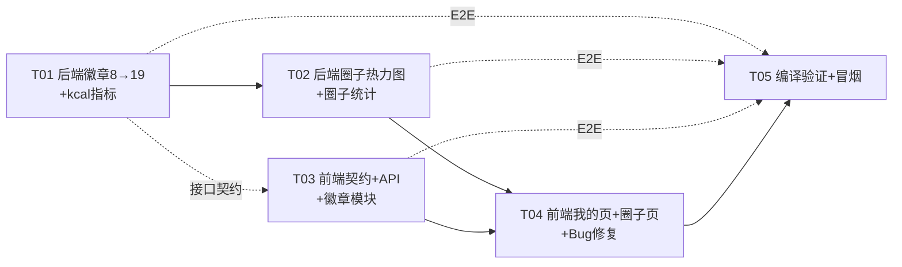

# 健身打卡微信小程序 — 系统设计（r3：徽章扩展 8→19 / 我的页改造 / 徽章列表页 / 圈子维度热力图与统计 / Bug 修复）

> 架构师：高见远（Bob）｜团队：software-fitness-badges
> 依据：团队主理人下发需求（用户已确认：全部做 / 热力图 180 天 / 徽章墙仅显示已解锁）
> 技术事实：docs/team-context.md + docs/system_design_r2.md + 已核实源码（BadgeCode / BadgeServiceImpl / CheckinController / CheckinServiceImpl / CheckinRecordMapper / CircleServiceImpl / profile.tsx / BadgeWall.tsx / Heatmap.tsx / detail.tsx / index.tsx / constants.ts / types/index.ts / app.config.ts / sql/init.sql）

---

## Part A: System Design

### 1. Implementation Approach

#### 1.1 核心难点与对策

| # | 难点 | 对策 |
|---|---|---|
| 1 | **BadgeCode 枚举从 8 扩到 19，且每个徽章要增加 category + sort**；现有枚举是"每常量实现 isUnlocked/progressText 抽象方法"的密集结构 | 保持抽象枚举风格，为构造器增加 `category`、`sort` 两个字段；新增 11 个枚举常量（见 §3.3 枚举明细）。输出顺序 = 枚举定义顺序 = 全局 sort 升序（1~19），`getMyBadges` 直接遍历 `values()` 即可，无需额外排序 |
| 2 | **新指标 estimatedKcal 的系数表需要与前端同步**（同里程系数 EXERCISE_SPEED_KMH 的双份风险） | 后端 `BadgeCode` 新增静态 `KCAL_PER_MIN`（running10/walking5/cycling8/swimming11/yoga4/gym7/other5 kcal/分钟，注释"与前端同步"）+ `estimateKcal(breakdown)`；`getUserCheckinStatsMine` 返回新增 `estimatedKcal` 字段；前端 `constants.ts` 新增同名 `KCAL_PER_MIN`。见 §8 同步约定 |
| 3 | **types_3 徽章判定依赖运动类型种类数** | `isUnlocked` 中遍历 `exerciseTypeBreakdown`，统计 `duration > 0` 的类型数 ≥ 3 |
| 4 | **徽章详情弹层需要"还差 X 解锁"**，若前端解析 progressText（"3/7天"）易碎 | 后端 `getMyBadges` 每个徽章新增 `remainText` 字段：用统一正则 `^(\d+)/(\d+)(.*)$` 解析 progressText，`target - cur > 0` 输出 `还差 N单位 解锁`，已解锁输出 null。所有徽章 progressText 格式统一（cur/target单位），一个解析器全覆盖，前端零计算 |
| 5 | **圈子维度热力图（按人数着色）与用户维度热力图（按分钟着色）共用组件** | `Heatmap` 组件增加 `mode: 'minutes' \| 'members'`（默认 minutes，向后兼容）与 `compact?: boolean`（8px 格子）；前端新增 `CIRCLE_HEATMAP_LEVELS`（0灰/1-2浅绿/3-5中绿/≥6深绿） |
| 6 | **圈子详情统计当前临时复用 /checkin/stats/mine（用户全局值，口径错误）** | 新增 `GET /checkin/stats/circle/{circleId}`，按 `circle_id` 聚合 `{totalDuration,totalCheckins,activeMembers(本周去重),avgDurationPerCheckin,todayActiveCount}`；前端 `CircleService.getCircleStats` 改指向新接口，detail.tsx 统计卡字段同步切换 |
| 7 | **Spring 路由冲突**：现有 `/checkin/stats/{planId}` 是变量路由，新增 `/checkin/stats/circle/{circleId}` 是字面量路由 | Spring MVC 字面量路由优先于变量路由，`/checkin/stats/mine`、`/checkin/stats/circle/5`、`/checkin/stats/5` 三者互不冲突（同理 `/checkin/heatmap/mine` 与 `/checkin/heatmap/circle/{id}`）。无需改动现有路由 |
| 8 | **循环依赖红线**：圈子热力图/统计需要校验"圈内成员" | `CheckinServiceImpl` 已注入 `CircleService`（现成依赖），在 service 层直接 `circleService.isCircleMember(circleId, userId)` 校验，非成员抛 `BusinessException.forbidden`。不新增任何反向依赖，无环 |
| 9 | **Taro 无内置 bottom sheet** | 徽章详情弹层自绘：固定定位遮罩 + 底部滑入面板（View + className），`badges.tsx` 内联实现，不引入第三方组件 |
| 10 | **徽章墙"仅显示已解锁图标"（用户决策）** | `BadgeWall` 增加 `iconOnly` 模式：只渲染 `unlocked === true` 的图标，5 列紧凑 grid（40-44px），点击回调 `onBadgeTap`；0 解锁时渲染占位提示。普通模式（3 列 grid + 名称 + 进度）保留给 career 页 |
| 11 | **我的页热力图 180 天** | profile `loadData` 增加 `CheckinService.getHeatmap(180)`，`Heatmap` 组件 `compact` 模式（格子 8px）渲染，点击格子复用现有明细弹层交互 |

#### 1.2 技术选型（零新依赖）

- **前端**：Taro 3 + React + TypeScript（现有）；新页面沿用 `pages/xxx/xxx.tsx + .scss + .config.ts` 三件套；徽章列表页自绘分组 grid 与弹层；Heatmap/BadgeWall 为现有组件扩展，不新增组件库。
- **后端**：Spring Boot 3.2.5 + MyBatis-Plus + MySQL（现有）；徽章定义继续由 `BadgeCode` 枚举集中管理；圈子维度统计/热力图归入 Checkin 模块（Mapper + Service + Controller）。
- **数据库**：**无需新表**（`user_badges` 已建；`checkin_records.circle_id` 已有值）。可选生产索引 `idx_checkin_records_circle_time(circle_id, checkin_time)`（圈子聚合查询加速，P1 可选）。
- **架构模式**：前后端分层不变；徽章判定仍由 `CheckinController` 编排 `BadgeService`（避免 CheckinService↔BadgeService 环）；圈子统计/热力图由 `CheckinServiceImpl` 实现（已持有 CircleService 可校验权限）。

---

### 2. File List

**后端（fitness-checkin-backend/src/main/java/com/fitness/checkin/）**

```
constant/BadgeCode.java                    # 改造：8→19 枚举；+category/+sort 构造字段；+KCAL_PER_MIN/+estimateKcal；+remainText 通用解析；+types_3 判定
service/impl/BadgeServiceImpl.java         # 改造：getMyBadges 输出 category/sort/remainText（向后兼容，旧字段不变）
service/CheckinService.java                # 改造：接口 +getHeatmapCircle +getCircleCheckinStats
service/impl/CheckinServiceImpl.java       # 改造：stats/mine 增加 estimatedKcal；+getHeatmapCircle +getCircleCheckinStats（成员权限校验）
controller/CheckinController.java          # 改造：+GET /heatmap/circle/{circleId} +GET /stats/circle/{circleId}
mapper/CheckinRecordMapper.java            # 改造：+selectHeatmapByCircleId +selectCircleStats +selectActiveMembersByCircleId +selectTodayActiveCountByCircleId
sql/init.sql                               # 改造：注释说明徽章 19 个；可选索引 idx_checkin_records_circle_time（生产 ALTER 见 §8）
```

**前端（src/）**

```
types/index.ts                             # 改造：BadgeInfo +category?/+sort?/+remainText?；UserExerciseStats +estimatedKcal；HeatmapDay/HeatmapData 兼容圈子模式；CircleStats 替代 CircleExerciseStats（新形状）
types/constants.ts                         # 改造：+KCAL_PER_MIN +CIRCLE_HEATMAP_LEVELS +BADGE_CATEGORY_CONFIG +BADGE_TOTAL_COUNT；PAGE_PATHS +PROFILE_BADGES
services/CheckinService.ts                 # 改造：+getCircleHeatmap(circleId, days) +getCircleStats(circleId)
services/CircleService.ts                  # 改造：getCircleStats 指向 /checkin/stats/circle/{circleId}（替代临时 /checkin/stats/mine）
app.config.ts                              # 改造：pages 注册 pages/profile/badges/badges
components/badge/BadgeWall.tsx / BadgeWall.scss    # 改造：+iconOnly 模式（5列紧凑 40-44px 图标，仅已解锁）+onBadgeTap 回调；普通模式保留
components/heatmap/Heatmap.tsx / Heatmap.scss      # 改造：+compact 模式（8px 格子）+mode('minutes'|'members') 着色 +圈子模式弹层文案
pages/profile/profile.tsx / profile.scss           # 改造：热力图 180 区块（用户卡下、徽章墙上）+徽章墙 iconOnly（已解锁 X/19 查看全部›）+跳转徽章列表页
pages/profile/badges/badges.tsx / badges.scss / badges.config.ts  # 新增：徽章列表页（总览卡 + 5 分类分组 + 3 列 grid + 底部详情弹层）
pages/circle/detail/detail.tsx / detail.scss       # 改造：统计卡字段切换圈子维度 + 运动统计下方渲染圈子热力图（members 模式）
pages/index/index.tsx                      # 改造：CircleCard +memberCount={circle.memberCount}（🔴 修 Bug）
```

---

### 3. Data Structures and Interfaces

#### 3.1 后端关键接口契约

- `GET /checkin/stats/mine` 响应 data（**新增 estimatedKcal**，旧字段不变）：
```json
{ "todayDuration": 30, "totalDuration": 120, "checkinDays": 3, "totalCheckins": 5,
  "currentStreak": 2, "completionRate": 66.7, "longestStreak": 5,
  "exerciseTypeBreakdown": [{"type":"running","duration":90},{"type":"walking","duration":30}],
  "estimatedDistanceKm": 14.5, "estimatedKcal": 750 }
```
- `GET /checkin/heatmap/circle/{circleId}?days=365` 响应 data（**新**；count=当日去重打卡人数，totalMinutes=当日总分钟）：
```json
{ "circleId": 2, "startDate": "2025-08-07", "endDate": "2026-08-06",
  "days": [ {"date":"2025-08-10","count":3,"totalMinutes":120}, ... ] }   // 仅返回有打卡的日期
```
  权限：圈子成员（`CircleService.isCircleMember`），非成员 403。
- `GET /checkin/stats/circle/{circleId}` 响应 data（**新**；activeMembers=本周去重打卡人数）：
```json
{ "circleId": 2, "totalDuration": 3000, "totalCheckins": 150,
  "activeMembers": 8, "avgDurationPerCheckin": 20, "todayActiveCount": 3 }
```
  权限：圈子成员，非成员 403。
- `GET /badges/mine` 响应 data（19 条，按枚举定义顺序 = sort 升序；**新增 category/sort/remainText**，旧字段不变）：
```json
[ {"code":"first_checkin","name":"初次打卡","icon":"🎉","conditionText":"累计打卡 1 次",
   "unlocked":true,"unlockedAt":"2026-08-06 10:00:00","progressText":"5/1次",
   "category":"days","sort":1,"remainText":null},
  {"code":"kcal_10000","name":"万卡燃烧","icon":"🔋","conditionText":"累计消耗 10000 千卡",
   "unlocked":false,"unlockedAt":null,"progressText":"1250/10000kcal",
   "category":"kcal","sort":12,"remainText":"还差 8750kcal 解锁"}, ... ]
```
- `POST /checkin` 响应不变（CheckinRecord + 瞬态 `newlyUnlockedBadges`，含新徽章 code/name/icon）。

#### 3.2 Mapper 新增 SQL（CheckinRecordMapper）

```sql
-- 圈子热力图：按天聚合（人数 = COUNT(DISTINCT user_id)）
SELECT DATE_FORMAT(checkin_time, '%Y-%m-%d') AS date,
       COUNT(DISTINCT user_id) AS count,
       COALESCE(SUM(duration), 0) AS totalMinutes
FROM checkin_records
WHERE circle_id = #{circleId} AND checkin_time >= #{startDate}
GROUP BY DATE_FORMAT(checkin_time, '%Y-%m-%d')
ORDER BY date ASC

-- 圈子累计统计
SELECT COUNT(*) AS totalCheckins, COALESCE(SUM(duration), 0) AS totalDuration
FROM checkin_records WHERE circle_id = #{circleId}

-- 本周活跃（去重打卡用户数）
SELECT COUNT(DISTINCT user_id) FROM checkin_records
WHERE circle_id = #{circleId} AND checkin_time >= #{weekStart}

-- 今日活跃（去重打卡用户数）
SELECT COUNT(DISTINCT user_id) FROM checkin_records
WHERE circle_id = #{circleId} AND checkin_time >= #{todayStart}
```

#### 3.3 BadgeCode 枚举扩展明细（8→19）

category 取值：`days / streak / duration / kcal / distance`；sort 为全局 1~19（=枚举定义顺序 = 返回顺序）。

| code | name | icon | category | sort | conditionText | 判定条件（stats） | progressText 示例 |
|---|---|---|---|---|---|---|---|
| first_checkin | 初次打卡 | 🎉 | days | 1 | 累计打卡 1 次 | totalCheckins ≥ 1 | "5/1次" |
| days_7 | 坚持7天 | 📅 | days | 2 | 累计打卡 7 天 | checkinDays ≥ 7 | "3/7天" |
| days_30 | 坚持30天 | 🗓️ | days | 3 | 累计打卡 30 天 | checkinDays ≥ 30 | "12/30天" |
| days_100 | 百日坚持 | 🏆 | days | 4 | 累计打卡 100 天 | checkinDays ≥ 100 | "40/100天" |
| **days_365** | 全年坚持 | 📆 | days | 5 | 累计打卡 365 天 | checkinDays ≥ 365 | "120/365天" |
| streak_7 | 连续7天 | 🔥 | streak | 6 | 最长连续打卡 7 天 | longestStreak ≥ 7 | "3/7天" |
| streak_30 | 连续30天 | 🌟 | streak | 7 | 最长连续打卡 30 天 | longestStreak ≥ 30 | "8/30天" |
| **streak_100** | 连续百天 | 💯 | streak | 8 | 最长连续打卡 100 天 | longestStreak ≥ 100 | "23/100天" |
| minutes_1000 | 千分俱乐部 | ⏱️ | duration | 9 | 累计运动 1000 分钟 | totalDuration ≥ 1000 | "500/1000分钟" |
| **checkins_100** | 百次打卡 | 🎯 | duration | 10 | 累计打卡 100 次 | totalCheckins ≥ 100 | "32/100次" |
| **minutes_5000** | 五千分钟 | ⏰ | duration | 11 | 累计运动 5000 分钟 | totalDuration ≥ 5000 | "1200/5000分钟" |
| **minutes_10000** | 万分钟俱乐部 | ⌛ | duration | 12 | 累计运动 10000 分钟 | totalDuration ≥ 10000 | "3000/10000分钟" |
| **kcal_10000** | 万卡燃烧 | 🔋 | kcal | 13 | 累计消耗 10000 千卡 | estimatedKcal ≥ 10000 | "1250/10000kcal" |
| **kcal_50000** | 五万卡达人 | 🔥 | kcal | 14 | 累计消耗 50000 千卡 | estimatedKcal ≥ 50000 | "8000/50000kcal" |
| **kcal_100000** | 十万卡传奇 | ⚡ | kcal | 15 | 累计消耗 100000 千卡 | estimatedKcal ≥ 100000 | "20000/100000kcal" |
| distance_50 | 里程达人 | 🚴 | distance | 16 | 累计运动里程 50 公里 | estimatedDistanceKm ≥ 50 | "20/50公里" |
| **distance_100** | 百公里勇士 | 🏃 | distance | 17 | 累计运动里程 100 公里 | estimatedDistanceKm ≥ 100 | "60/100公里" |
| **distance_500** | 五百公里远征 | 🚀 | distance | 18 | 累计运动里程 500 公里 | estimatedDistanceKm ≥ 500 | "180/500公里" |
| **types_3** | 全能选手 | 🎨 | distance | 19 | 累计参与 3 种运动 | exerciseTypeBreakdown 中 duration>0 的类型数 ≥ 3 | "2/3种" |

**新增静态系数与方法（BadgeCode）**：
```java
/** 消耗系数表（kcal/分钟），与前端 constants.KCAL_PER_MIN 必须同步 */
private static final Map<String, Double> KCAL_PER_MIN = new HashMap<>();
static { KCAL_PER_MIN.put("running", 10.0); KCAL_PER_MIN.put("walking", 5.0);
         KCAL_PER_MIN.put("cycling", 8.0);  KCAL_PER_MIN.put("swimming", 11.0);
         KCAL_PER_MIN.put("yoga", 4.0);      KCAL_PER_MIN.put("gym", 7.0);
         KCAL_PER_MIN.put("other", 5.0); }

/** 估算累计消耗（千卡）：Σ(duration × 系数) */
public static double estimateKcal(List<Map<String, Object>> exerciseTypeBreakdown) { ... }

/** 统一解析 progressText "cur/target单位" → "还差 N单位 解锁" / null（已解锁） */
static String remainText(String progressText) { ... }
```

**getMyBadges 输出映射（BadgeServiceImpl）**：在现有 item 基础上追加
```java
item.put("category", badge.getCategory());
item.put("sort", badge.getSort());
item.put("remainText", unlocked ? null : BadgeCode.remainText(badge.progressText(stats)));
```

#### 3.4 前端类型/常量变更

```ts
// types/index.ts
export interface BadgeInfo {
  code: string; name: string; icon: string; conditionText: string;
  unlocked: boolean; unlockedAt?: Timestamp | null; progressText: string;
  category?: string;   // 新增：days/streak/duration/kcal/distance
  sort?: number;       // 新增：全局 1~19
  remainText?: string | null; // 新增：未解锁"还差 N 解锁"，已解锁 null
}
export interface UserExerciseStats {
  // ...既有字段
  estimatedKcal: number // 新增：估算总消耗（千卡）
}
export interface HeatmapDay {
  date: string
  minutes?: number      // 用户模式（分钟着色）
  count: number         // 用户模式=打卡次数；圈子模式=当日打卡人数
  totalMinutes?: number // 圈子模式：当日总分钟
}
export interface HeatmapData {
  startDate: string; endDate: string
  days: HeatmapDay[]
  circleId?: ID        // 圈子热力图返回
}
export interface CircleStats {          // 替代 CircleExerciseStats（新形状）
  circleId: ID
  totalDuration: number    // 圈子累计总时长（分钟）
  totalCheckins: number    // 圈子累计打卡次数
  activeMembers: number    // 本周去重打卡人数
  avgDurationPerCheckin: number // 平均每次时长（分钟，= totalDuration/totalCheckins，除零保护）
  todayActiveCount: number // 今日去重打卡人数
}
export interface BadgeWallProps {
  badges: BadgeInfo[]
  limit?: number
  iconOnly?: boolean              // 新增：仅已解锁图标，5 列紧凑 grid
  onBadgeTap?: (badge: BadgeInfo) => void // 新增：点击徽章回调（iconOnly 模式）
}
export interface HeatmapProps {
  data: HeatmapData
  compact?: boolean               // 新增：8px 格子（我的页）
  mode?: 'minutes' | 'members'    // 新增：着色维度（默认 minutes）
  showMore?: boolean              // 新增：右上角"更多›"（我的页→运动生涯）
  onMore?: () => void
}

// types/constants.ts 新增
export const KCAL_PER_MIN: Record<string, number> = {
  running: 10, walking: 5, cycling: 8, swimming: 11, yoga: 4, gym: 7, other: 5
} // 与后端 BadgeCode.KCAL_PER_MIN 必须同步
export const CIRCLE_HEATMAP_LEVELS = [
  { min: 0, color: '#EBEDF0' },  // 0 人：灰
  { min: 1, color: '#9BE9A8' },  // 1-2 人：浅绿
  { min: 3, color: '#40C463' },  // 3-5 人：中绿
  { min: 6, color: '#216E39' }   // ≥6 人：深绿
] as const
export const BADGE_CATEGORY_CONFIG: Record<string, { name: string; icon: string }> = {
  days:     { name: '坚持天数', icon: '📅' },
  streak:   { name: '连续成就', icon: '🔥' },
  duration: { name: '运动时长', icon: '⏱️' },
  kcal:     { name: '能量消耗', icon: '🔋' },
  distance: { name: '里程全能', icon: '🚴' }
} as const
export const BADGE_TOTAL_COUNT = 19
export const PAGE_PATHS = { /* ...既有 */ PROFILE_BADGES: '/pages/profile/badges/badges' } as const
```

---

### 4. Program Call Flow

关键时序（完整版见 `docs/sequence-diagram-r3.mermaid`）：

1. **打卡 → 徽章判定**：`CheckinController.checkin` → `CheckinServiceImpl.checkin`（写入记录，circle_id 自动归属）→ `getUserCheckinStatsMine`（含 estimatedKcal）→ `BadgeServiceImpl.checkAndUnlock`（遍历 19 枚举，新解锁 insertIgnore）→ 响应挂 `newlyUnlockedBadges`。
2. **我的页加载**：`Profile.loadData` 并行 `BadgeService.getMyBadges()` + `CheckinService.getHeatmap(180)` → 渲染热力图 compact 区块 + 徽章墙 iconOnly（已解锁 X/19）；"查看全部›"/点徽章 → `navigateTo('/pages/profile/badges/badges')`；热力图"更多›" → career。
3. **徽章列表页加载**：`Badges.loadData` → `getMyBadges()` → 按 `category` 分组（BADGE_CATEGORY_CONFIG 顺序 + sort 升序）→ 渲染总览卡（X/19 + 进度条）+ 5 组 3 列 grid → 点击徽章自绘底部弹层（图标/名称/conditionText/progressText/remainText/unlockedAt）。
4. **圈子详情加载**：`CircleDetail.loadData` 并行 detail + members + plans + `CircleService.getCircleStats(circleId)`（→ GET /checkin/stats/circle/{id}）+ `CircleService.getCircleHeatmap(circleId, 365)`（→ GET /checkin/heatmap/circle/{id}）→ 统计卡渲染圈子维度字段 + 运动统计下方渲染 `Heatmap mode='members'`（人数色阶）。

---

### 5. Anything UNCLEAR（假设与待确认）

1. **estimatedKcal 前端展示**：需求仅要求后端返回与徽章判定。假设 career 页"更多数据"4 宫格保持现状（今日/最长连续/平均每次/总里程），不新增 kcal 展示；kcal 进度通过徽章 progressText 天然呈现。若产品希望 career 页展示 kcal 总消耗，属 T05 后可追加的小改动。
2. **旧数据回填**：枚举扩展后，历史已达标用户的新徽章不会自动解锁——徽章判定仅在 POST /checkin 触发。假设**不做历史回填脚本**（新徽章从下次打卡起正常判定），与现网 8 徽章机制一致。
3. **圈子热力图格子点击**：圈子维度无个人历史页可跳。假设点击弹层仅展示"X 人打卡 · 累计 Y 分钟"，不提供"查看记录"跳转（复用 showModal，confirm 关闭）。
4. **圈子统计"本周"口径**：假设周一起始的本自然周（`LocalDate.now().with(DayOfWeek.MONDAY)` 起），与热力图 days=365 无耦合。
5. **徽章列表页弹层**：假设自绘底部滑入面板（遮罩 + 固定定位），不做 Taro 半屏组件封装；关闭方式：遮罩点击 / 关闭按钮。
6. **categories 顺序**：前端分组顺序固定为 `days → streak → duration → kcal → distance`（BADGE_CATEGORY_CONFIG 键序），组内按后端 sort（=数组序）。
7. **days 参数截断**：沿用 r2 约定，用户/圈子热力图 days ∈ [7, 365]，超界截断。
8. **生产索引**：圈子聚合查询（circle_id + checkin_time）建议加索引 `idx_checkin_records_circle_time`；若数据量小可暂缓，标注 P1 可选。

---

## Part B: Task Decomposition

### 6. Required Packages

本轮**不新增**第三方依赖：
```
（无新增：前端 Taro 3 + React + TypeScript；后端 Spring Boot / MyBatis-Plus / Lombok）
```

### 7. Task List（有序，按依赖，5 个任务）

#### T01 后端：徽章扩展 8→19 + kcal 指标 — P0
- **Source Files**：`fitness-checkin-backend/src/main/java/com/fitness/checkin/constant/BadgeCode.java`、`.../service/impl/BadgeServiceImpl.java`、`.../service/impl/CheckinServiceImpl.java`、`fitness-checkin-backend/sql/init.sql`
- **Dependencies**：无
- **内容**：
  - `BadgeCode`：构造器增加 `category`/`sort`；新增 11 个枚举（days_365/streak_100/checkins_100/minutes_5000/minutes_10000/kcal_10000/kcal_50000/kcal_100000/distance_100/distance_500/types_3），按 §3.3 表补齐判定与 progressText；新增 `KCAL_PER_MIN` + `estimateKcal(breakdown)`；新增 `remainText(progressText)` 通用解析；`types_3` 判定 = breakdown 中 duration>0 类型数 ≥ 3；类注释同步"19 个徽章"。
  - `CheckinServiceImpl.getUserCheckinStatsMine`：追加 `stats.put("estimatedKcal", BadgeCode.estimateKcal(exerciseTypeBreakdown))`（exerciseTypeBreakdown 已查询，零额外 SQL）。
  - `BadgeServiceImpl.getMyBadges`：遍历 `BadgeCode.values()` 时追加输出 `category`、`sort`、`remainText`（未解锁非 null；已解锁 null）。checkAndUnlock 逻辑不变（自动覆盖 19 个）。
  - `sql/init.sql`：`user_badges` 表注释更新为 19 徽章；可选加注释 `idx_checkin_records_circle_time`（实际生产 ALTER 见 §8，P1）。
- **验收**：`mvn clean package -DskipTests` 通过；curl 冒烟 `GET /badges/mine` 返回 19 条且字段含 category/sort/remainText、sort 升序；`GET /checkin/stats/mine` 含 estimatedKcal；打卡后新徽章可解锁（构造测试数据验证 kcal_10000 等）。

#### T02 后端：圈子热力图 + 圈子统计 — P0
- **Source Files**：`.../mapper/CheckinRecordMapper.java`、`.../service/CheckinService.java`、`.../service/impl/CheckinServiceImpl.java`、`.../controller/CheckinController.java`
- **Dependencies**：T01（CheckinServiceImpl/CheckinRecordMapper 已被 T01 触碰，串行避免冲突）
- **内容**：
  - `CheckinRecordMapper`：+`selectHeatmapByCircleId(circleId, startDate)`（§3.2 SQL，返回 date/count/totalMinutes）、+`selectCircleStats(circleId)`（totalCheckins/totalDuration）、+`selectActiveMembersByCircleId(circleId, weekStart)`、+`selectTodayActiveCountByCircleId(circleId, todayStart)`。
  - `CheckinService` 接口 + `CheckinServiceImpl` 实现：
    - `getHeatmapCircle(circleId, userId, days)`：先 `circleService.isCircleMember` 校验（非成员 forbidden）；days 截断 [7,365]；返回 `{circleId, startDate, endDate, days:[{date,count,totalMinutes}]}`。
    - `getCircleCheckinStats(circleId, userId)`：校验成员；`selectCircleStats` + `selectActiveMembersByCircleId`（本周一 00:00 起）+ `selectTodayActiveCountByCircleId`（今日 00:00 起）；`avgDurationPerCheckin = totalCheckins>0 ? round(totalDuration/totalCheckins) : 0`；返回 `{circleId,totalDuration,totalCheckins,activeMembers,avgDurationPerCheckin,todayActiveCount}`。
  - `CheckinController`：+`GET /heatmap/circle/{circleId}`（days 默认 365）、+`GET /stats/circle/{circleId}`；失败降级返回空结构（沿用现有风格）。
- **验收**：`mvn clean package -DskipTests` 通过；curl 冒烟：成员可查圈子热力图/统计且口径为圈子维度（非用户全局）；非成员 403；days 截断正确。

#### T03 前端：数据契约 + API 层 + 徽章模块（BadgeWall iconOnly + 徽章列表页 + 路由） — P0
- **Source Files**：`src/types/index.ts`、`src/types/constants.ts`、`src/app.config.ts`、`src/components/badge/BadgeWall.tsx`、`src/components/badge/BadgeWall.scss`、`src/pages/profile/badges/badges.tsx`、`src/pages/profile/badges/badges.scss`、`src/pages/profile/badges/badges.config.ts`
- **Dependencies**：T01（接口契约：BadgeInfo.category/sort/remainText、estimatedKcal）；可与 T02 并行
- **内容**：
  - types：BadgeInfo 增 `category?/sort?/remainText?`；UserExerciseStats 增 `estimatedKcal`；HeatmapDay/HeatmapData 兼容圈子模式（count/totalMinutes/circleId）；`CircleStats` 新形状替代 `CircleExerciseStats`（删除或保留旧名？——删除旧接口并全局替换引用，避免双形状混乱）；BadgeWallProps/HeatmapProps 扩展。
  - constants：`KCAL_PER_MIN`、`CIRCLE_HEATMAP_LEVELS`、`BADGE_CATEGORY_CONFIG`、`BADGE_TOTAL_COUNT=19`、`PAGE_PATHS.PROFILE_BADGES`。
  - `BadgeWall`：新增 `iconOnly` 模式（仅渲染 unlocked 图标、5 列紧凑 grid、图标 40-44px、点击 onBadgeTap）；0 解锁渲染占位"暂无解锁徽章，快去打卡吧"；普通模式（3 列 + 名称 + progressText）逻辑保留；BadgeWall.scss 增加 iconOnly 样式。
  - `badges` 页（新增三件套）：`useDidShow` 加载 `BadgeService.getMyBadges()`；总览卡（已解锁 X/19 + 进度条 width=X/19*100%）；按 BADGE_CATEGORY_CONFIG 键序分组、组标题（icon + 名称 + 该类解锁数）、组内 3 列 grid（icon + name + unlocked?已解锁:progressText）；点击徽章 → 自绘底部弹层（大 icon/name/conditionText/progressText/remainText/unlockedAt 格式化）。
  - `app.config.ts`：注册 `pages/profile/badges/badges`。
- **验收**：`npx tsc --noEmit` 通过；徽章列表页 19 条按 5 分类分组展示、总览计数正确、弹层详情字段齐全；career 页 BadgeWall 普通模式不受影响。

#### T04 前端：我的页改造 + 圈子页集成 + Bug 修复 — P0
- **Source Files**：`src/pages/profile/profile.tsx`、`src/pages/profile/profile.scss`、`src/components/heatmap/Heatmap.tsx`、`src/components/heatmap/Heatmap.scss`、`src/services/CheckinService.ts`、`src/services/CircleService.ts`、`src/pages/circle/detail/detail.tsx`、`src/pages/circle/detail/detail.scss`、`src/pages/index/index.tsx`
- **Dependencies**：T02（圈子接口）、T03（types/constants/BadgeWall 就绪）
- **内容**：
  - `Heatmap` 组件：+`compact`（格子 8px、样式复用）、+`mode`（members 模式按 `day.count` 用 `CIRCLE_HEATMAP_LEVELS` 着色）、+`showMore/onMore`（区块右上角"更多›"）、成员模式弹层文案"X 人打卡 · 累计 Y 分钟"（无跳转）；minutes 模式现有交互（弹层 + 跳历史页）保留；Heatmap.scss 增加 compact/更多样式。
  - `profile.tsx`：loadData 并行 `getMyBadges()` + `CheckinService.getHeatmap(180)`；布局：用户卡 → 热力图区块（标题"活跃度" + 更多› 跳 career，`Heatmap compact mode='minutes'`）→ 徽章墙区块（标题"我的徽章 已解锁 X/19" + 查看全部› 跳 badges，`BadgeWall iconOnly onBadgeTap→badges`）→ 功能菜单；菜单"运动生涯"保留；`unlockedCount = badges.filter(b=>b.unlocked).length`。
  - `CheckinService`：+`getCircleHeatmap(circleId, days=365)`、+`getCircleStats(circleId)`。
  - `CircleService.getCircleStats`：改 `request('/checkin/stats/circle/' + circleId)`，返回类型 `CircleStats`。
  - `detail.tsx`：stats 状态类型 `UserExerciseStats → CircleStats`；统计卡 4 宫格改为圈子维度（今日打卡 `todayActiveCount` 人 / 总运动时长 `formatDuration(totalDuration)` / 打卡次数 `totalCheckins` 次 / 本周活跃 `activeMembers` 人）；`loadData` 并行增加 `getCircleHeatmap(circleId, 365)`；在"运动统计"区块下方、"当前计划"区块上方渲染 `Heatmap mode='members'` 区块（标题"圈子活跃度"）。
  - `index.tsx`：`CircleCard` 增加 `memberCount={circle.memberCount}`（🔴 修 Bug，circle.tsx 已传、首页漏传）。
- **验收**：我的页热力图 180 天 compact 渲染、徽章墙仅显示已解锁图标且计数正确、查看全部跳徽章列表页；圈子详情统计为圈子维度、圈子热力图按人数色阶渲染、位置在运动统计下/当前计划上；首页圈子卡人数不再显示 0。

#### T05 编译验证 + 端到端冒烟 — P0
- **Source Files**：（验证任务，无新源文件；复检 T01-T04 产物）
- **Dependencies**：T01、T02、T03、T04
- **内容**：
  - 后端：`mvn clean package -DskipTests` 通过；部署 `systemctl restart fitness-checkin`（124.222.95.76）。
  - 前端：`npx tsc --noEmit`（0 error）→ `npx taro build --type weapp` 通过（卡住则后台运行/重试）。
  - 端到端 curl 冒烟：`GET /badges/mine` 19 条含新字段；`GET /checkin/stats/mine` 含 estimatedKcal；`GET /checkin/heatmap/circle/{id}?days=180`、`GET /checkin/stats/circle/{id}` 正常；非成员 403。
  - grep 复核：`\._id|\.circle_id|\.member_count\b|stats\.todayDuration|stats\.checkinDays|stats\.completionRate`（圈子详情残留用户维度字段）为 0。
- **验收**：全站编译通过、接口冒烟全绿、无 undefined 字段、无圈子统计口径残留。

---

### 8. Shared Knowledge（跨任务约定）

- **API 响应**：统一 `{code,data,message}`，成功 `code===200`；失败降级返回空结构（沿用 Controller try-catch 风格）。
- **字段命名**：线上 JSON 一律驼峰；禁止 `_id`/下划线访问（既有约定勿回退）。
- **状态/角色数字**：圈子 status 1活跃/0归档；成员 role 0普通/1管理员/2创建者；计划 status 0未开始/1进行中/2已结束。
- **徽章枚举顺序**：`BadgeCode.values()` 顺序 = 全局 sort 升序（1~19）= `GET /badges/mine` 返回顺序；前端分组仅按 category，组内沿用数组顺序。
- **kcal 系数表（两端必须同步）**：running 10 / walking 5 / cycling 8 / swimming 11 / yoga 4 / gym 7 / other 5（kcal/分钟）。后端 `BadgeCode.KCAL_PER_MIN` 与前端 `constants.KCAL_PER_MIN` 各一份，改一端必须同步另一端（同里程系数 EXERCISE_SPEED_KMH 的既有风险）。
- **里程系数表（两端必须同步，沿用 r2）**：running 8 / walking 5 / cycling 15 / swimming 3 / 其余 0（km/h）。
- **热力图着色常量**：用户维度 `HEATMAP_LEVELS` 0灰/1-29浅绿/30-59中绿/≥60深绿（按分钟）；圈子维度 `CIRCLE_HEATMAP_LEVELS` 0灰/1-2浅绿/3-5中绿/≥6深绿（按人数）。Heatmap `mode` 决定取值维度。
- **圈子维度权限**：`GET /checkin/heatmap/circle/{circleId}`、`GET /checkin/stats/circle/{circleId}` 均须为圈子成员，非成员抛 `BusinessException.forbidden`；校验在 `CheckinServiceImpl`（已注入 CircleService，无新依赖）。
- **GET /badges/mine 兼容**：新增 category/sort/remainText 为追加字段，旧消费方（career 页、旧客户端）不受影响；前端 `BadgeInfo.category?` 可选。
- **GET /checkin/stats/mine 兼容**：新增 estimatedKcal 为追加字段；圈子详情页**不再**使用该接口（改为 stats/circle），仅个人页/career 页使用。
- **POST /checkin 响应**：data 为 CheckinRecord + 瞬态 `newlyUnlockedBadges:[{code,name,icon}]`，形状不变，勿包裹。
- **避免循环依赖**：徽章判定继续由 `CheckinController` 编排 `BadgeService`（CheckinService 不注入 BadgeService）；圈子统计/热力图放 `CheckinServiceImpl`（单向依赖 CircleService），禁止反向。
- **生产 SQL（P1 可选）**：`ALTER TABLE checkin_records ADD INDEX idx_checkin_records_circle_time (circle_id, checkin_time);`（圈子聚合加速；低峰执行，先备份）。
- **基建**：前端 baseURL `http://124.222.95.76/api`；编译 `npx taro build --type weapp`（可能卡住，后台运行/重试）；后端 `mvn clean package -DskipTests` + `systemctl restart fitness-checkin`；MySQL `fitness_user/Fitness@2026`。
- **勿回退**：`code===200`、`/checkin` 单数、统计字段驼峰、tabbar 图标 `src/assets/tabbar/`、邀请码 8 位校验、上传 name='file'。

### 9. Task Dependency Graph



---

## 附：风险与注意事项

1. **系数表双份同步（🔴 高风险）**：KCAL_PER_MIN 与 EXERCISE_SPEED_KMH 均在前后端各一份，改一端忘另一端会"解锁了但展示不符"。已在 §8 标注；建议 T01 完成时 grep 后端 `KCAL_PER_MIN` 与前端 `KCAL_PER_MIN` 值一致。
2. **圈子统计口径切换**：detail.tsx 统计卡从用户维度（todayDuration/checkinDays/completionRate）切换为圈子维度（todayActiveCount/totalDuration/totalCheckins/activeMembers），字段名全变，务必同步更新类型与模板；T05 grep 复核残留旧字段引用。
3. **权限红线**：圈子热力图/统计接口必须校验成员；Controller 捕获异常降级为空结构时，不能掩盖权限校验失败（403 应透出——沿用现有 `Result.error` 风格）。
4. **徽章枚举扩展的旧用户影响**：已解锁 8 个徽章数据不受影响；新徽章从下次打卡起判定（无历史回填）。若产品要求回填，需另写一次性脚本（本轮不做）。
5. **路由无冲突**：`/checkin/stats/{planId}` 与 `/checkin/stats/circle/{circleId}` 字面量优先匹配，无需改旧路由；勿在 circle 前加新变量段。
6. **Heatmap 向后兼容**：`compact`/`mode`/`showMore` 均为可选 props，默认值 = 现有行为（12px 格子、minutes 色阶），career 页零改动。
7. **BadgeWall 向后兼容**：`iconOnly` 默认 false，普通模式逻辑不变；career 页零改动。
8. **徽章列表页弹层**：自绘 bottom sheet 注意 z-index 与遮罩滚动穿透（`catchMove`），关闭后清空选中徽章状态。
9. **生产 DB**：本轮无必须 DDL；可选索引按 §8 低峰执行。
10. **前端编译**：`npx taro build --type weapp` 可能卡住，后台运行并重试；T05 完成后 grep 复核字段残留为 0。
