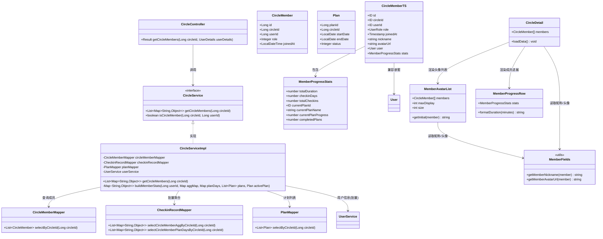
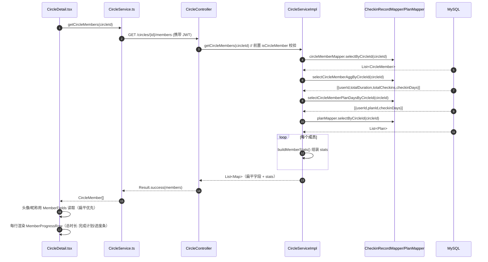
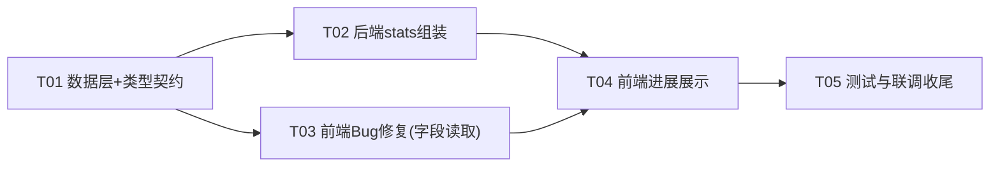

# 系统设计 R4：圈子成员运动进展 + 头像/名字 Bug 修复

- 作者：高见远（软件架构师）
- 日期：2026-08-01
- 关联文档：`system_design_r3.md`（R3 全量设计）、`db_design_review.md`（数据模型）
- 范围：仅新增「圈子详情页成员运动进展」功能 + 修复成员头像/名字不显示 Bug，不改动其他模块

---

## 一、Bug 根因与修复方案（已确认）

### 1.1 根因

后端 `GET /circles/{id}/members`（`CircleServiceImpl.getCircleMembers`）返回的是**扁平字段**：

```json
[
  { "id": 1, "circleId": 10, "userId": 100, "joinedAt": "...", "role": 0,
    "nickname": "小明", "avatarUrl": "https://..." }
]
```

而前端两处读取的是**嵌套字段**：

- `src/pages/circle/detail/detail.tsx`（L505、L509、L514）：`member.user?.avatarUrl`、`member.user?.nickname`
- `src/components/circle/MemberAvatarList.tsx`（L32、L49、L52）：`member.user?.nickname`、`member.user?.avatarUrl`

→ `member.user` 恒为 `undefined`，头像与昵称永远不显示（回退到占位符 `?` / `未知用户`）。

同时 `types/index.ts` 中 `CircleMember` 只声明了 `user?: User` 嵌套字段，未声明扁平字段，类型层也无法发现该问题。

### 1.2 修复选型：前端改读扁平字段（兼容嵌套）

| 方案 | 说明 | 结论 |
|---|---|---|
| A. 前端改读扁平字段 | 修改 detail.tsx、MemberAvatarList.tsx，读取 `member.nickname` / `member.avatarUrl`，并兼容 `member.user?.xxx` 嵌套 | ✅ **推荐**。MemberAvatarList 是通用组件，后续可能被计划详情、打卡记录等页面复用（后端 CheckinRecord 的 user 字段就是嵌套结构），做「扁平优先 + 嵌套兜底」的兼容读取最稳妥 |
| B. 后端套一层 user 对象 | 后端 members 接口改为 `{...member, user: {userId, nickname, avatarUrl}}` | ❌ 会改变现有接口契约，且 CheckinRecord 列表的用户信息是嵌套结构，两处数据结构不一致会给前端带来长期混乱 |

**最终方案**：新增前端工具函数 `getMemberNickname(member)` / `getMemberAvatarUrl(member)`，读取顺序为「扁平 `member.nickname/avatarUrl` → 嵌套 `member.user?.nickname/avatarUrl` → 兜底值」，两处组件统一改用它。

---

## 二、Part A：系统设计

### A1. 实现思路（Implementation Approach）

#### 核心难点

1. **避免 N+1 查询**：为 N 个成员各自计算统计，若逐成员查打卡聚合 + 逐成员查计划完成情况，会产生 2N+ 次 SQL。圈子最大 50 人，但依然应按**批量聚合**设计。
2. **口径统一**：`currentPlanProgress`（当前进行中计划完成率）必须与现有 `getUserCheckinStats` 的口径一致——`打卡天数 / 计划总天数 × 100`，避免同一指标两套算法。
3. **兼容性**：成员接口返回结构在 R3 已是扁平字段，前端类型需同步补齐，且展示层不破坏既有成员行布局。

#### 技术选型

- 后端沿用 Spring Boot 3 + MyBatis-Plus（`@Select` 注解 SQL），无需新增依赖。
- 成员进展聚合使用 **2 条批量 GROUP BY SQL**（圈子维度一次性取回所有成员的聚合 + 成员×计划的打卡天数），配合已有 `PlanMapper.selectByCircleId` 一次取回全部计划，在 Service 层内存组装。
- 前端沿用 Taro + React 函数组件，新增 1 个纯函数工具 `memberFields.ts`（可单测）+ 1 个展示组件 `MemberProgressRow`，复用现有 `formatDuration` 思路。

#### 架构模式

- 后端：分层架构（Controller → Service → Mapper），沿用现有模式，不引入新框架。
- 前端：组件化 + 纯函数工具（页面 detail.tsx 只做数据编排，展示逻辑下沉到组件/工具函数，便于 jest 单测）。

### A2. 文件清单（File List）

#### 后端（fitness-checkin-backend/src/main/java/com/fitness/checkin/）

| 文件 | 操作 | 说明 |
|---|---|---|
| `mapper/CheckinRecordMapper.java` | 修改 | 新增 2 个圈子×成员批量聚合方法（见 A3） |
| `mapper/UserMapper.java` | 可选修改 | 批量查用户（BaseMapper.selectBatchIds 已可用，一般无需改动） |
| `service/CircleService.java` | 修改 | `getCircleMembers` 契约注释更新（返回附带 stats） |
| `service/impl/CircleServiceImpl.java` | 修改 | `getCircleMembers` 内组装 stats；新增私有方法 `buildMemberStats(...)` |
| `service/UserService.java` / `service/impl/UserServiceImpl.java` | 可选修改 | 新增 `List<User> getUsersByIds(Collection<Long>)` 批量查询（消除逐成员查用户的 N+1，建议 P2 一并做） |
| `controller/CircleController.java` | 不改 | 仅验证（已有 isCircleMember 权限校验） |

#### 前端（src/）

| 文件 | 操作 | 说明 |
|---|---|---|
| `types/index.ts` | 修改 | `CircleMember` 增加扁平 `nickname/avatarUrl` + `stats`；新增 `MemberProgressStats` 接口 |
| `utils/memberFields.ts` | 新建 | `getMemberNickname` / `getMemberAvatarUrl`（扁平优先、嵌套兼容） |
| `utils/index.ts` | 修改 | 导出 memberFields 工具 |
| `pages/circle/detail/detail.tsx` | 修改 | 成员行改读工具函数；集成 `MemberProgressRow` |
| `pages/circle/detail/detail.scss` | 修改 | 成员行 progress 文本/进度条样式 |
| `components/circle/MemberAvatarList.tsx` | 修改 | 头像/首字母改读工具函数 |
| `components/circle/MemberProgressRow.tsx` | 新建 | 成员进展展示组件（文本 + 迷你进度条） |
| `components/circle/MemberProgressRow.scss` | 新建 | 组件样式 |

#### 测试（__tests__/）

| 文件 | 操作 | 说明 |
|---|---|---|
| `__tests__/utils/memberFields.test.ts` | 新建 | 扁平/嵌套/缺失字段用例 |
| `__tests__/types/types.test.ts` | 修改 | 补充 `MemberProgressStats` 结构校验 |
| `docs/API_MEMBER_PROGRESS.md` | 新建（可选） | 接口契约说明（或并入 TEST_REPORT.md 联调清单） |

### A3. 数据结构与接口（Data Structures and Interfaces）

#### 后端接口契约

`GET /circles/{id}/members` 响应 `data` 数组元素（在既有扁平字段基础上**新增 `stats` 键**，其余不变，向后兼容）：

```json
{
  "id": 1,
  "circleId": 10,
  "userId": 100,
  "joinedAt": "2026-07-01T10:00:00",
  "role": 0,
  "nickname": "小明",
  "avatarUrl": "https://...",
  "stats": {
    "totalDuration": 320,
    "checkinDays": 9,
    "totalCheckins": 12,
    "currentPlanId": 55,
    "currentPlanName": "晨跑7天挑战",
    "currentPlanProgress": 71.4,
    "completedPlans": 2
  }
}
```

**stats 字段口径定义**（全部限定在**该圈子内**：`checkin_records.circle_id = 圈子ID AND user_id = 成员ID`）：

| 字段 | 类型 | 口径 |
|---|---|---|
| `totalDuration` | number | 该圈打卡总时长（分钟），`SUM(duration)`，无记录为 0 |
| `checkinDays` | number | 该圈打卡天数，`COUNT(DISTINCT DATE(checkin_time))` |
| `totalCheckins` | number | 该圈打卡次数，`COUNT(*)`（附赠，便于展示） |
| `currentPlanId` | number\|null | 该圈子「当前进行中计划」（status=1）的 planId；无则 null |
| `currentPlanName` | string\|null | 进行中计划名称 |
| `currentPlanProgress` | number | 该成员在**当前进行中计划**的完成率：`该成员该计划打卡天数 / (计划endDate-startDate+1) × 100`，四舍五入保留 1 位小数，clamp 0~100；无进行中计划为 0 |
| `completedPlans` | number | 该圈 **status=2 已结束计划**中、该成员有打卡记录的**去重计划数**（成员未打卡的已结束计划不计入） |

#### 新增 Mapper 方法（CheckinRecordMapper）

```java
/**
 * 圈子×成员批量聚合（一次 SQL 取回所有成员在该圈子的总时长/次数/天数）
 */
@Select("SELECT user_id AS userId, " +
        "COALESCE(SUM(duration), 0) AS totalDuration, " +
        "COUNT(*) AS totalCheckins, " +
        "COUNT(DISTINCT DATE_FORMAT(checkin_time, '%Y-%m-%d')) AS checkinDays " +
        "FROM checkin_records WHERE circle_id = #{circleId} " +
        "GROUP BY user_id")
List<Map<String, Object>> selectCircleMemberAggByCircleId(@Param("circleId") Long circleId);

/**
 * 圈子×成员×计划 打卡天数（用于计算进行中计划完成率与已完成计划数）
 */
@Select("SELECT user_id AS userId, plan_id AS planId, " +
        "COUNT(DISTINCT DATE_FORMAT(checkin_time, '%Y-%m-%d')) AS checkinDays " +
        "FROM checkin_records " +
        "WHERE circle_id = #{circleId} AND plan_id IS NOT NULL " +
        "GROUP BY user_id, plan_id")
List<Map<String, Object>> selectCircleMemberPlanDaysByCircleId(@Param("circleId") Long circleId);
```

复用已有 `PlanMapper.selectByCircleId(circleId)` 取计划列表（含 status/startDate/endDate）。

#### Service 组装算法（CircleServiceImpl.getCircleMembers 增强）

```
members = circleMemberMapper.selectByCircleId(circleId)          // 现有
aggMap  = selectCircleMemberAggByCircleId(circleId)  → Map<userId, {totalDuration,totalCheckins,checkinDays}>
planDays= selectCircleMemberPlanDaysByCircleId(circleId)→ Map<userId, Map<planId, checkinDays>>
plans   = planMapper.selectByCircleId(circleId)       → Map<planId, Plan>；activePlan = status==1 且 startDate 最早者
finishedPlanIds = plans 中 status==2 的 planId 集合

for member in members:
    stats = { totalDuration, checkinDays, totalCheckins }          // 从 aggMap 取，缺省 0
    if activePlan != null:
        stats.currentPlanId     = activePlan.planId
        stats.currentPlanName   = activePlan.name
        totalDays = activePlan.endDate - activePlan.startDate + 1
        days      = planDays[member.userId]?[activePlan.planId] ?: 0
        stats.currentPlanProgress = round(days / totalDays * 100, 1)   // clamp 0~100
    else:
        stats.currentPlanId/Name = null; progress = 0
    stats.completedPlans = count(planId in finishedPlanIds 且 planDays[member.userId] 含该 planId)
    memberInfo.put("stats", stats)
```

**SQL 复杂度**：成员列表 = 3 条批量 SQL（成员 + 聚合 + 计划打卡）+ 1 条计划列表 + 用户信息查询。相较 R3 的「N 次查用户」，仅多 2 条固定 SQL，无 N+1。

#### classDiagram



### A4. 程序调用流程（Program Call Flow）

#### 核心流程：加载圈子详情（成员列表带进展）



#### 说明

- 该流程覆盖新功能的主链路（读）；「创建计划/打卡」等写操作沿用 R3 流程不变。
- Bug 修复不改变接口形状，只改变前端读取方式（扁平优先 + 嵌套兜底），无新增调用链。

### A5. 不确定项（Anything UNCLEAR）

1. **多进行中计划**：当前业务假设一个圈子至多 1 个进行中计划（`createCircle` 只生成 1 个初始计划，`startPlan` 未做并发约束）。若未来允许多个进行中计划，`currentPlanProgress` 需明确为「所有进行中计划的加权/汇总完成率」（参考 R3 `calcCompletionRate` 的合计口径）。本次按「取 startDate 最早的进行中计划」实现。
2. **已完成计划数口径**：采用「该圈 status=2 计划中该成员有打卡记录的去重数」。若产品希望统计「成员**加入后**才结束的计划」，需追加 `circle_members.joined_at` 时间过滤——本次不采用（成员加入前宽松打卡同样记入圈子，口径简单一致）。
3. **用户信息 N+1**：R3 已存在逐成员 `getUserById`（N 次查询）。本次建议顺带改为批量查询（P2），若工程师评估改动面过大可保留现状，不影响 stats 功能。
4. **后端单测环境**：仓库当前未见后端 `src/test` 目录，T05 以「前端单测 + 联调清单」为主，后端以编译与接口冒烟为准。

---

## 三、Part B：任务分解（Task Decomposition）

### B1. 所需依赖（Required Packages）

无新增第三方依赖：

```
后端：MyBatis-Plus（已存在，注解 SQL 足够，无需引入 XML/新框架）
前端：Taro + React（已存在，新增为纯函数与组件，无新 npm 包）
```

### B2. 任务清单（Task List，共 5 个）

> 任务按依赖排序；T02 与 T03 均只依赖 T01，可并行；T04 收口展示；T05 联调收尾。

| ID | 任务名 | 源文件 | 依赖 | 优先级 |
|---|---|---|---|---|
| **T01** | 接口契约与数据层：后端批量聚合 SQL + 前端类型扩展 | `mapper/CheckinRecordMapper.java`（新增 2 方法）、`src/types/index.ts`（CircleMember 扁平字段 + MemberProgressStats）、`src/services/CircleService.ts`（契约注释） | 无 | P0 |
| **T02** | 后端服务层：getCircleMembers 附加 stats 组装 | `service/CircleService.java`、`service/impl/CircleServiceImpl.java`（buildMemberStats + 组装）、`service/UserService.java`+`service/impl/UserServiceImpl.java`（可选批量查用户 P2）、`controller/CircleController.java`（验证不改） | T01 | P0 |
| **T03** | 前端 Bug 修复：成员字段扁平优先兼容读取 | `src/utils/memberFields.ts`（新建）、`src/utils/index.ts`（导出）、`src/pages/circle/detail/detail.tsx`（改读）、`src/components/circle/MemberAvatarList.tsx`（改读） | T01 | P0 |
| **T04** | 前端展示：成员运动进展行 | `src/components/circle/MemberProgressRow.tsx`（新建）、`src/components/circle/MemberProgressRow.scss`（新建）、`src/pages/circle/detail/detail.tsx`（集成）、`src/pages/circle/detail/detail.scss`（样式） | T02、T03 | P0 |
| **T05** | 测试与联调收尾 | `__tests__/utils/memberFields.test.ts`（新建）、`__tests__/types/types.test.ts`（更新）、`docs/API_MEMBER_PROGRESS.md`（新建：接口契约/联调清单） | T03、T04 | P1 |

**T04 展示规格**（紧凑，不破坏成员行布局）：
- 成员行 `member-info` 下方新增一行 `.member-progress`（22rpx 次级文本）：
  - 无进行中计划：`总时长 30分钟 · 已完成 1/3 计划`（completedPlans / 圈子已结束计划总数）
  - 有进行中计划：`当前计划 71% · 总时长 30分钟`，并在其下渲染 6rpx 高迷你进度条（`currentPlanProgress`）
- 无打卡记录成员显示 `暂无运动记录`，保持行高一致。

### B3. 共享知识（Shared Knowledge）

- 所有 API 响应统一 `{code, data, message}`；成功 code=200。
- 线上 JSON 一律**驼峰**（nickname/avatarUrl/joinedAt/currentPlanProgress）；ID（Long）前端统一用 string 承载。
- 圈子内统计口径：一律以 `checkin_records.circle_id = 圈子ID` 过滤（宽松打卡也带 circleId）。
- 计划完成率口径：`打卡天数 / (endDate - startDate + 1) × 100`，与 R3 `getUserCheckinStats` 完全一致，禁止另起算法。
- 成员角色：0 普通 / 1 管理员 / 2 创建者（数字）；计划状态：0 未开始 / 1 进行中 / 2 已结束（数字）。
- `MemberAvatarList` 为通用组件，读取用户信息必须走 `MemberFields` 工具（扁平优先 + 嵌套兜底），不得直接写 `member.user?.xxx`。

### B4. 任务依赖图（Task Dependency Graph）



---

## 四、交付物

- 本文档：`docs/system_design_r4.md`
- 类图：`docs/class-diagram-r4.mermaid`
- 时序图：`docs/sequence-diagram-r4.mermaid`
