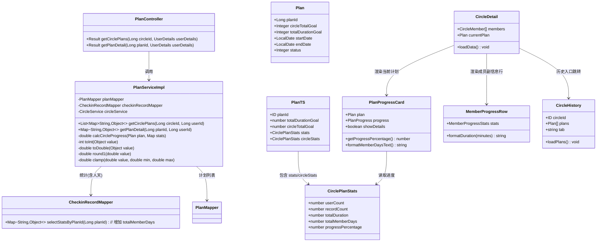
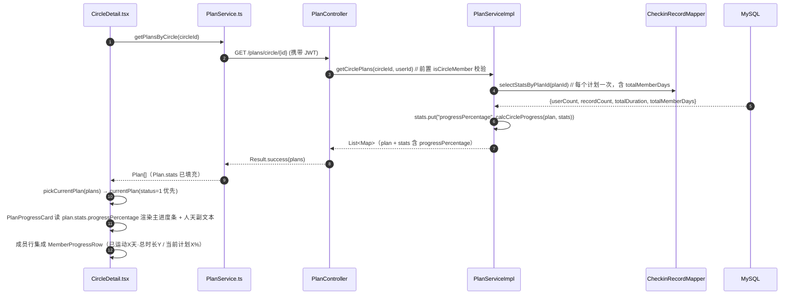
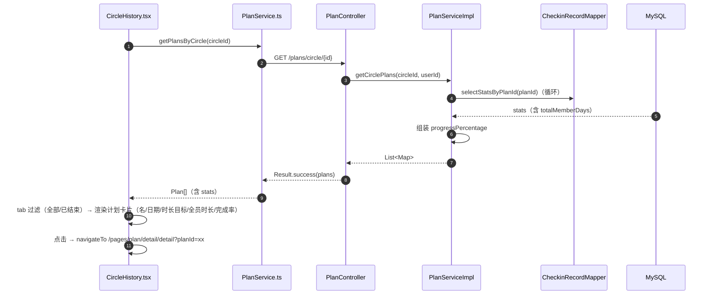
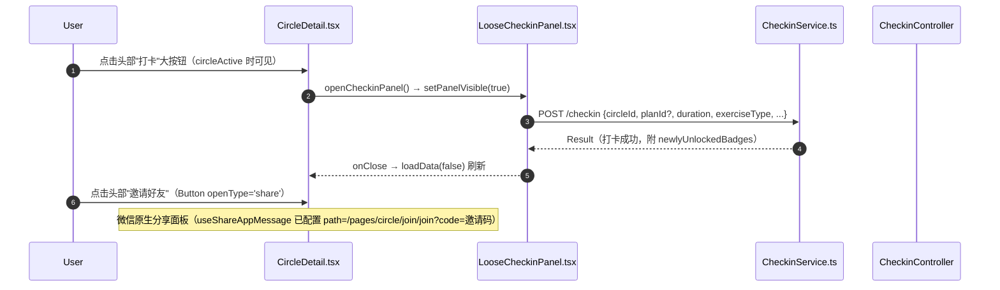
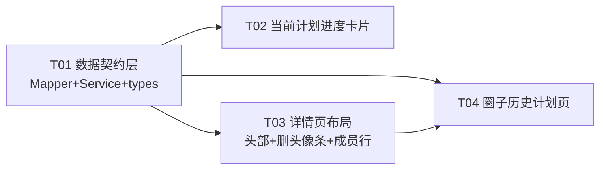

# 系统设计 R5：圈子详情页第二轮调整（进度口径 / 历史计划 / 成员行 / 头部布局）

- 作者：高见远（软件架构师）
- 日期：2026-08-01
- 关联文档：`system_design_r4.md`（成员进展 stats，R5 在其上增量）、`team-context.md`
- 范围：仅圈子详情页相关的 6 项用户需求，不新增第三方依赖，不改动其他模块

---

## 〇、已排查事实（代码级核实，非猜测）

| # | 排查项 | 结论 |
|---|---|---|
| 1 | 进度恒 0 根因 | `PlanProgressCard.tsx` 只读 `progress.progressPercentage`；圈子详情页调用 `<PlanProgressCard plan={currentPlan} onTap=...>` **未传 progress prop** → `getProgressPercentage()` 恒返回 0。且 `GET /plans/circle/{id}` 返回的 `plan.stats` 仅 `{userCount, recordCount, totalDuration}`（`CheckinRecordMapper.selectStatsByPlanId`），无 `progressPercentage` |
| 2 | 成员展示重复 | `detail.tsx` L511 渲染 `<MemberAvatarList>` 头像条 + L516 渲染成员列表（头像+昵称+角色角标+右侧进展文本） |
| 3 | 历史计划入口错页 | `detail.tsx` L552-554 跳 `/pages/profile/history/history?circleId=xx`（个人打卡记录页，主题是 CheckinCard 记录） |
| 4 | 成员行进展现状 | `detail.tsx` 内联 `formatMemberProgress()`（L300-316、L544）展示；`MemberProgressRow.tsx` 组件**已存在但未被 detail 引用**（死组件，可复用改造） |
| 5 | 头像条影响面 | `MemberAvatarList` 仅 `detail.tsx` 引用（grep 确认）；`types/index.ts` 的 `MemberAvatarListProps` 仅被 `__tests__/types/types.test.ts` L103 断言引用 |
| 6 | 计划详情页同病 | `pages/plan/detail/detail.tsx` 也复用 `PlanProgressCard`（传 progress，但后端 `getPlanDetail` 返回 Map 无 `progressPercentage` 字段）→ 该页进度同样显示 0（顺带修复项） |

---

## Part A：系统设计

### A1. 实现思路（Implementation Approach）

#### 核心难点

1. **进度口径从「个人」切换到「圈子整体」**：时长维度的分母必须是"圈子总目标"（`circleTotalGoal`），且要考虑 `circleTotalGoal=0`（未设置）的退化；天数维度需要"全员打卡人天"这一新的聚合指标（同一人同一天多笔只计 1 人天）。
2. **一次改造同时修复两处进度 0**：`PlanProgressCard` 是圈子详情页与计划详情页共享组件，字段读取必须做"新字段优先、旧字段兜底"的兼容链，避免只修一处。
3. **detail.tsx 是高频改动的单点**：头部按钮、删头像条、成员行、历史入口全部落在 `detail.tsx`，任务切分必须按功能分层收敛，避免多任务互相覆盖同一文件。
4. **成员行信息密度**：要在不破坏 80rpx 头像行高太多的情况下，把「昵称/角标 + 已运动天数 + 运动时长 + 当前计划进度」塞进一行，采用"名字行 + 副信息行"两行紧凑布局。

#### 技术选型

- **后端**：沿用 Spring Boot 3 + MyBatis-Plus 注解 SQL，**修改 1 条现有 SQL（`selectStatsByPlanId`）** 即可同时获得 `totalMemberDays`，无需新增 Mapper 方法、无需新依赖。
- **前端**：沿用 Taro + React。改造共享组件 `PlanProgressCard`、复用并升级 `MemberProgressRow`（由死代码转为正式成员行副信息组件）；新增 1 个页面（历史计划）。
- **架构模式**：后端分层（Controller → Service → Mapper）不变；前端组件化 + 兼容性读取工具不变。

---

### A2. 文件清单（File List）

#### 后端（fitness-checkin-backend/src/main/java/com/fitness/checkin/）

| 文件 | 操作 | 说明 |
|---|---|---|
| `mapper/CheckinRecordMapper.java` | 修改 | `selectStatsByPlanId` SQL 增加 `totalMemberDays`（全员打卡人天，`COUNT(DISTINCT user_id, DATE_FORMAT(checkin_time,'%Y-%m-%d'))`） |
| `service/impl/PlanServiceImpl.java` | 修改 | 新增私有 `calcCircleProgress(plan, stats)` 计算圈子整体时长进度；`getCirclePlans` 组装 `stats.progressPercentage`；`getPlanDetail` 的 `circleStats` 同款组装（顺带修复计划详情页进度） |

#### 前端（src/）

| 文件 | 操作 | 说明 |
|---|---|---|
| `types/index.ts` | 修改 | 新增 `CirclePlanStats` 接口；`Plan` 增加 `stats?` / `circleStats?`；删除 `MemberAvatarListProps`（随 T03 删头像条） |
| `services/PlanService.ts` | 修改 | 契约注释同步（`getPlansByCircle` 返回含 stats.progressPercentage；`getPlanDetail` 返回含 circleStats） |
| `components/plan/PlanProgressCard.tsx` | 修改 | 进度读取兼容链（stats 优先）；副文本展示人天/计划天数/参与人数；label 改"圈子进度" |
| `components/plan/PlanProgressCard.scss` | 修改 | 副文本样式 |
| `pages/plan/detail/detail.tsx` | 修改 | 适配新字段（顺带修复，改动小） |
| `pages/circle/detail/detail.tsx` | 修改 | 头部按钮布局（邀请+打卡大按钮）、删头像条、删底部 action-buttons、成员行集成 MemberProgressRow、历史入口改跳新页 |
| `pages/circle/detail/detail.scss` | 修改 | header action-row 样式、成员两行布局样式 |
| `components/circle/MemberProgressRow.tsx` | 修改 | 从"单行文本+迷你进度条"升级为"已运动天数/总时长副信息行 + 右对齐当前计划进度"两行组件 |
| `components/circle/MemberProgressRow.scss` | 修改 | 对应样式 |
| `components/circle/MemberAvatarList.tsx` | 删除 | 无其他引用，随头像条删除（含 `.scss`） |
| `pages/circle/history/history.tsx` | 新建 | 圈子历史计划列表页 |
| `pages/circle/history/history.scss` | 新建 | 页面样式 |
| `app.config.ts` | 修改 | pages 注册 `'pages/circle/history/history'` |

#### 测试（__tests__/）

| 文件 | 操作 | 说明 |
|---|---|---|
| `__tests__/types/types.test.ts` | 修改 | 删除 `MemberAvatarListProps` 断言，新增 `CirclePlanStats`/`Plan.stats` 断言 |
| `__tests__/utils/progressCalc.test.ts` | 新建（可选 P2） | 前端进度口径纯函数单测（若将进度计算抽为工具） |

---

### A3. 数据结构与接口（Data Structures and Interfaces）

#### 1）圈子维度计划进度口径（核心）

**主进度条 = 时长进度**（百分比，唯一进度条数值来源）：

```
effectiveGoal =
    circleTotalGoal > 0           → circleTotalGoal                 // 圈子总目标（分钟）
    circleTotalGoal <= 0 且 userCount > 0 → totalDurationGoal × userCount  // 退化：人均目标 × 参与打卡人数
    userCount = 0                 → 0（分母为 0，进度 0）

progressPercentage = clamp( round1( totalDuration / effectiveGoal × 100 ), 0, 100 )
```

- `totalDuration`：`selectStatsByPlanId` 的 `SUM(duration)`（该计划全员累计时长，分钟）
- `userCount`：该计划参与打卡的去重人数（`COUNT(DISTINCT user_id)`）
- 退化解释：`circleTotalGoal` 未设置（初始计划系统默认 420，但用户创建时可能传 0）时，按"每个参与者完成个人总目标"估算圈子目标；无人打卡时进度 0

**天数维度 = 副文本**（不进主进度条，避免与时长目标打架）：

```
totalMemberDays = COUNT(DISTINCT user_id, DATE_FORMAT(checkin_time,'%Y-%m-%d'))
                  // 全员打卡人天：同一用户同一天多笔只计 1 人天
totalDays       = endDate - startDate + 1（计划天数）
展示文本         = "全员打卡 {totalMemberDays}人天 · 计划 {totalDays}天 · 参与 {userCount}人"
```

**展示方案（PlanProgressCard 卡片内）**：

```
[晨跑7天挑战]               [进行中]
3月1日 - 3月7日
┌──────────────────────────────────┐
圈子进度                   76.2%     ← label 由"完成进度"改"圈子进度"
███████████████░░░░░░░░░░░░░░░░░░  │
全员打卡 12人天 · 计划7天 · 参与5人  ← 新增副文本（小字，stats 缺失时隐藏）
└──────────────────────────────────┘
🎯 每日目标: 30分钟   ⏱️ 最低打卡: 10分钟
```

#### 2）接口契约变更

`GET /plans/circle/{id}` → `data[]` 元素（**stats 向后兼容，仅新增字段**）：

```json
{
  "planId": 55, "circleId": 10, "name": "晨跑7天挑战", "status": 1,
  "startDate": "2026-08-01", "endDate": "2026-08-07",
  "totalDurationGoal": 210, "circleTotalGoal": 420,
  "dailyDurationGoal": 30, "minDurationPerCheckin": 10,
  "stats": {
    "userCount": 5,
    "recordCount": 12,
    "totalDuration": 320,
    "totalMemberDays": 9,
    "progressPercentage": 76.2
  }
}
```

`GET /plans/{planId}`（getPlanDetail）→ `circleStats` 同款增加 `totalMemberDays` / `progressPercentage`（顺带修复计划详情页进度 0）。

#### 3）Mapper SQL 变更（唯一改动点）

```java
@Select("SELECT " +
        "COUNT(DISTINCT user_id) as userCount, " +
        "COUNT(*) as recordCount, " +
        "COALESCE(SUM(duration), 0) as totalDuration, " +
        "COUNT(DISTINCT user_id, DATE_FORMAT(checkin_time, '%Y-%m-%d')) as totalMemberDays " +
        "FROM checkin_records WHERE plan_id = #{planId}")
Map<String, Object> selectStatsByPlanId(Long planId);
```

> MySQL 支持 `COUNT(DISTINCT col1, col2)` 多列去重。`getCirclePlans` 与 `getPlanDetail` 共用此方法，一次改动两处生效。

#### 4）Service 组装（PlanServiceImpl 新增私有方法）

```java
/**
 * 圈子整体时长进度：全员累计时长 ÷ 圈子总目标 × 100
 * circleTotalGoal>0 用之；否则退化 totalDurationGoal × userCount；分母≤0 返回 0
 */
private double calcCircleProgress(Plan plan, Map<String, Object> stats) {
    double totalDuration = toDouble(stats.get("totalDuration"));
    int userCount = toInt(stats.get("userCount"));
    int circleTotalGoal = plan.getCircleTotalGoal() == null ? 0 : plan.getCircleTotalGoal();
    int perUserGoal = plan.getTotalDurationGoal() == null ? 0 : plan.getTotalDurationGoal();
    double denominator = circleTotalGoal > 0 ? circleTotalGoal : (double) perUserGoal * userCount;
    if (denominator <= 0) return 0d;
    return clamp(round1(totalDuration * 100.0 / denominator), 0d, 100d);
}
```

- 在 `getCirclePlans` 的 stream map 内：`stats.put("progressPercentage", calcCircleProgress(plan, stats))`
- 在 `getPlanDetail` 内：`circleStats.put("progressPercentage", calcCircleProgress(plan, circleStats))`
- `PlanServiceImpl` 需补私有小工具 `toInt/toDouble/round1/clamp`（与 `CircleServiceImpl` 现有实现一致，重复 4 个小函数可接受；若想消除重复，P2 可抽 `util/StatsCalc.java` 静态工具，**本轮不改动 CircleServiceImpl 以免影响 R4 已测功能**）

#### 5）前端类型

```ts
/** 计划圈子统计（对齐 GET /plans/circle/{id} 的 stats 键 / GET /plans/{planId} 的 circleStats 键） */
export interface CirclePlanStats {
  userCount: number        // 该计划参与打卡的去重人数
  recordCount: number      // 该计划打卡次数
  totalDuration: number    // 该计划全员累计时长（分钟）
  totalMemberDays: number  // 全员打卡人天（同人同日去重）
  progressPercentage: number // 圈子整体时长进度（0-100，clamp，circleTotalGoal 为 0 时退化人均×人数）
}

export interface Plan {
  // ...现有字段不变
  stats?: CirclePlanStats       // GET /plans/circle/{id} 返回
  circleStats?: CirclePlanStats // GET /plans/{planId} 返回（计划详情页）
}
```

`PlanProgressCard` 进度读取兼容链：

```
percentage =
    plan.stats?.progressPercentage          // 圈子详情页（列表接口）— 主路径
    ?? plan.circleStats?.progressPercentage // 计划详情页（详情接口）
    ?? progress?.progressPercentage         // 旧 PlanProgress 兼容
    ?? 0
```

#### 6）classDiagram



---

### A4. 程序调用流程（Program Call Flow）

#### 流程 1：圈子详情页加载（当前计划圈子进度 + 成员两行信息 + 头部按钮）



#### 流程 2：圈子历史计划页加载



#### 流程 3：打卡（头部大按钮）与邀请（头部 share 按钮）



---

### A5. 不确定项（Anything UNCLEAR）

1. **退化分母用「参与打卡人数 userCount」而非「圈子成员总数」**：circleTotalGoal=0 时，进度分母 = totalDurationGoal × userCount。若产品希望按圈子总人数估算（更严格），改动仅一处（userCount → 圈子成员数，需额外查询）。本轮按参与人数，语义为"对实际动起来的人按人均目标考核"。
2. **天数维度展示口径**：采用"全员打卡人天 / 计划天数"（人天 = 同人同日去重）。若希望展示"计划日历进度（已进行 X/Y 天）"，则为另一指标（时间进度，与打卡无关），本轮不做。
3. **计划详情页（/pages/plan/detail）进度顺带修复**：getPlanDetail 的 circleStats 增加同款字段、前端兼容链读取即可修复，成本极低，建议纳入本轮 T02；若想严格控范围可只做圈子详情页，PlanProgressCard 兼容链保留（stats 缺失时回退旧行为）。
4. **MemberAvatarList 删除范围**：建议连同组件文件 + `MemberAvatarListProps` 类型 + types.test.ts 断言一并删除（已确认无其他引用）；若担心未来复用可仅移除引用保留文件（会产生死代码，不推荐）。
5. **历史计划页默认 Tab**：建议默认「全部」（含进行中/未开始/已结束，按时间倒序，每项有状态标签），顶部 Tab 切「已结束」；若产品只想要已结束，默认 Tab 改为已结束即可（前端一行常量）。

---

## Part B：任务分解（Task Decomposition）

### B1. 所需依赖（Required Packages）

无新增第三方依赖：

```
后端：MyBatis-Plus（已存在，注解 SQL 足够）
前端：Taro + React（已存在）
```

### B2. 任务清单（Task List，共 4 个）

> 任务按依赖排序；T02、T03 均只依赖 T01 可并行；T04 依赖 T03（复用已改的 detail.tsx）。每个任务 ≥3 文件。

| ID | 任务名 | 源文件 | 依赖 | 优先级 |
|---|---|---|---|---|
| **T01** | 数据契约层：后端计划统计加圈子进度字段 + 前端类型扩展 | `mapper/CheckinRecordMapper.java`（selectStatsByPlanId 增 totalMemberDays）、`service/impl/PlanServiceImpl.java`（calcCircleProgress + getCirclePlans/getPlanDetail 组装 progressPercentage + 私有 toInt/toDouble/round1/clamp）、`src/types/index.ts`（CirclePlanStats + Plan.stats/circleStats）、`src/services/PlanService.ts`（契约注释）、`__tests__/types/types.test.ts`（新增断言） | 无 | P0 |
| **T02** | 当前计划进度卡片：圈子整体进度 + 人天副文本 | `src/components/plan/PlanProgressCard.tsx`（兼容链读取 + label 改"圈子进度" + 人天副文本）、`src/components/plan/PlanProgressCard.scss`（副文本样式）、`src/pages/plan/detail/detail.tsx`（适配 circleStats，顺带修复）、`__tests__/utils/progressCalc.test.ts`（可选 P2：进度计算纯函数） | T01 | P0 |
| **T03** | 详情页布局：头部按钮 + 删头像条 + 成员行详细化 | `src/pages/circle/detail/detail.tsx`（头部邀请+打卡大按钮、删 MemberAvatarList 引用、删底部 action-buttons、成员行集成 MemberProgressRow、删 formatMemberProgress）、`src/pages/circle/detail/detail.scss`（header action-row + 成员两行样式）、`src/components/circle/MemberProgressRow.tsx` + `.scss`（升级两行组件）、删除 `src/components/circle/MemberAvatarList.tsx` + `.scss`、`src/types/index.ts`（删 MemberAvatarListProps）、`__tests__/types/types.test.ts`（同步删断言） | T01 | P0 |
| **T04** | 圈子历史计划页：新页面 + 路由 + 入口跳转 | `src/pages/circle/history/history.tsx`（新建：汇总条 + Tab + 计划列表）、`src/pages/circle/history/history.scss`（新建）、`src/app.config.ts`（注册 pages/circle/history/history）、`src/pages/circle/detail/detail.tsx`（历史入口跳转 URL 改新页） | T01、T03 | P1 |

**T02 展示规格**（PlanProgressCard）：
- 进度条 label：`完成进度` → `圈子进度`；数值 = `plan.stats?.progressPercentage ?? plan.circleStats?.progressPercentage ?? progress?.progressPercentage ?? 0`（1 位小数展示，`showDetails` 传了 progress 时仍显示详情区块）
- 进度条下方新增副文本（22rpx 灰色）：`全员打卡 {totalMemberDays}人天 · 计划 {totalDays}天 · 参与 {userCount}人`；`stats` 缺失时整行隐藏（不影响旧调用方）
- `totalDays` 由 `plan.startDate/endDate` 计算（差 +1），避免依赖后端字段

**T03 展示规格**：
- 头部 `header-content` 内 `name-row` 下方新增 `header-actions` 行（仅 circleActive 渲染，已归档整行隐藏）：
  - 「邀请好友」：`<Button openType='share'>`，半透明白底、白字描边胶囊（flex:1）
  - 「打卡」：大主按钮，`📸` 48rpx 图标 + `打卡` 28rpx 文字，白底蓝字（或渐变蓝底白字）、高 88rpx、flex:1.3 突出
  - 删除底部 `.action-buttons` 区块与 `name-row` 内原 `.header-checkin-btn`
- 成员行（member-item）两行布局：
  - 左：头像 80rpx；中（flex:1）：行1 昵称+角色角标 / 行2 副信息 `已运动 9天 · 总时长 3小时20分钟`（stats.checkinDays / stats.totalDuration，无记录→`暂无运动记录`）；右（右对齐）：有进行中计划→`当前计划 71%`（+迷你进度条），无→`已完成 2/3计划`

**T04 页面规格**：
- 路由：`/pages/circle/history/history?circleId=xx`（新页面，tab 页外 navigateTo）
- 数据：复用 `PlanService.getPlansByCircle(circleId)`（无新后端接口），前端按 status 过滤
- 页面结构：顶部汇总条（历史计划数=status2 计数 / 累计全员时长=SUM(stats.totalDuration) / 平均完成率）/ Tab「全部 / 已结束」/ 计划卡片列表（计划名 + 状态标签 + 日期区间 + 时长目标 circleTotalGoal（0 显示"--"）+ 全员完成时长 + 完成率 progressPercentage% + 迷你进度条）/ 空态「暂无历史计划」
- 点击卡片 → `/pages/plan/detail/detail?planId=xx`

### B3. 共享知识（Shared Knowledge）

- 所有 API 响应统一 `{code, data, message}`；成功 code=200；线上 JSON 一律驼峰。
- **圈子整体时长进度口径（唯一）**：`全员累计时长 totalDuration ÷ effectiveGoal × 100`；`effectiveGoal = circleTotalGoal>0 ? circleTotalGoal : totalDurationGoal × userCount`；clamp 0~100，分母≤0 为 0。禁止另起算法。
- **全员打卡人天口径（唯一）**：`COUNT(DISTINCT user_id, DATE_FORMAT(checkin_time,'%Y-%m-%d'))`，同一人同一天多笔计 1 人天。
- 计划状态：0 未开始 / 1 进行中 / 2 已结束；成员角色：0 普通 / 1 管理员 / 2 创建者；圈子状态：1 活跃 / 0 已归档（数字）。
- `PlanProgressCard` 为共享组件（圈子详情页 + 计划详情页），进度读取必须走兼容链 `plan.stats → plan.circleStats → progress → 0`，不得只读单一字段。
- 成员行信息一律读取 `member.stats`（圈子维度，来自 GET /circles/{id}/members 的 stats 键，R4 已上线），昵称/头像走 `getMemberNickname/getMemberAvatarUrl`（扁平优先 + 嵌套兜底）。
- 个人运动历史页 `/pages/profile/history/history` 保留不动（我的页、热力图入口仍引用），历史计划新页与它互不干扰。
- `MemberAvatarList` 删除后不得再被引用；`MemberAvatarListProps` 类型与 types.test.ts 断言同步删除。

### B4. 任务依赖图（Task Dependency Graph）



---

## 四、交付物

- 本文档：`docs/system_design_r5.md`
- 类图：`docs/class-diagram-r5.mermaid`
- 时序图：`docs/sequence-diagram-r5.mermaid`
